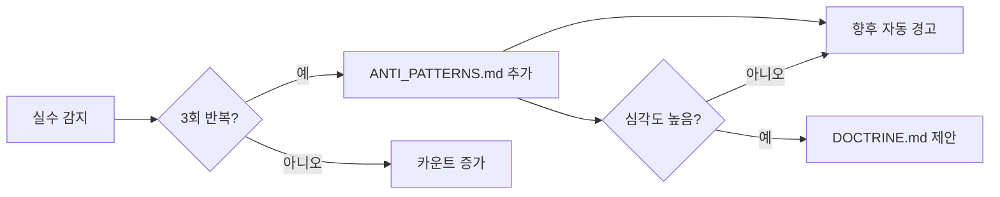

# ANTI_PATTERNS: 반복 실수 방지록

> **실수를 두 번 하지 않기 위한 패턴 라이브러리**
>
> 동일한 실수가 3회 반복되면 자동으로 여기에 기록되고,
> 미래에 동일한 패턴이 감지되면 경고를 발생시킵니다.

---

## 🚨 감지 시스템

### 트리거 조건

- 동일한 타입의 에러가 3회 반복
- 사용자가 동일한 수정을 3회 요청
- 코드 리뷰에서 동일한 지적이 3회 발생

### 자동 처리



---

## ❌ 코드 수준 Anti-Patterns

### AP-001: 상대 경로 남용

**문제**: `import { utils } from '../../../lib/utils';`
**해결**: `import { utils } from '@/lib/utils';`
**감지**: `../../../` 패턴 발견 시 경고

---

### AP-002: any 타입 사용

**문제**: `function process(data: any) { }`
**해결**: `function process<T extends BaseData>(data: T) { }`
**감지**: `: any` 패턴 발견 시 차단

---

### AP-003: 주석 처리된 죽은 코드

**문제**: 10줄 이상 주석 블록
**해결**: 완전히 삭제 (Git 히스토리에 있음)
**감지**: 10줄 이상 연속 주석 발견 시 경고

---

### AP-004: 하드코딩된 비밀정보

**문제**: `const API_KEY = "sk-1234567890abcdef";`
**해결**: `const API_KEY = process.env.NEXT_PUBLIC_API_KEY;`
**감지**: `sk-`, `pk-`, `password`, `secret` 패턴 발견 시 차단

---

### AP-005: 깊은 중첩 if문

**문제**: 3단계 이상 중첩
**해결**: Guard Clause (Early Return) 패턴
**감지**: 3단계 이상 중첩 시 리팩토링 제안

---

### AP-006: try-catch 없는 비동기 호출

**문제**: `const data = await fetchData();` (try 블록 밖)
**해결**: try-catch 래핑 + 사용자 피드백(toast)
**감지**: `await` 키워드가 try 블록 밖에 있으면 경고

---

### AP-007: 200줄 넘는 거대 파일

**문제**: 단일 파일에 모든 로직 집중
**해결**: 책임에 따라 모듈 분리
**감지**: 200줄 초과 시 분리 제안

---

### AP-008: useEffect 의존성 배열 누락

**문제**: `useEffect(() => { fetchData(userId); }, []);`
**해결**: `useEffect(() => { fetchData(userId); }, [userId]);`
**감지**: ESLint exhaustive-deps 규칙

---

### AP-009: 불필요한 파생 state

**문제**: fullName을 별도 useState로 관리
**해결**: `const fullName = \`\${firstName} \${lastName}\`;` (계산)
**감지**: 다른 state에서 파생 가능한 state 감지

---

### AP-010: console.log 커밋

**문제**: 디버그용 console.log 제거 누락
**해결**: 커밋 전 제거 또는 Pre-commit 훅
**감지**: `console.log`, `console.dir` 패턴 발견 시 경고

---

## ❌ 작업 프로세스 Anti-Patterns (실전 추가)

### AP-011: 무한 재시도 (Brute Force Retry)

**문제**: 동일한 접근법으로 3회 이상 실패해도 같은 방법 반복
**근본원인**: 에러 메시지를 정확히 분석하지 않음
**해결**:

1. 2회 연속 실패 시 즉시 중단
2. 에러 메시지 정밀 분석
3. 완전히 다른 접근법 제시
4. 사용자 확인 후 재시도

**실제 사례**: PKCE 인증 에러를 동일 설정 반복 수정으로 해결 시도 (대화 35d80d88)

---

### AP-012: 컨텍스트 미확인 착수 (Blind Start)

**문제**: 기존 코드를 읽지 않고 바로 구현 시작
**근본원인**: 시간 절약을 위한 성급한 시작
**해결**:

1. 관련 파일 먼저 읽기 (view_file, view_file_outline)
2. 기존 패턴 파악
3. 코드 스타일/컨벤션 일치 확인
4. 그 다음 구현

**감지**: 구현 시작 전 관련 파일 읽기 호출이 없으면 경고

---

### AP-013: 대량 동시 수정 (Shotgun Surgery)

**문제**: 5개 이상 파일을 한 번에 수정하여 diff 누적
**근본원인**: 빠른 완료를 위한 과욕
**해결**:

1. 한 번에 최대 3개 파일 수정
2. 수정 후 빌드/타입 체크
3. 통과 후 다음 배치

**감지**: 검증 없이 5개 이상 파일 수정 시도 시 경고

---

### AP-014: 무비판적 패턴 복사 (Copy-Paste Cargo Cult)

**문제**: 다른 프로젝트의 코드를 맥락 없이 복사
**근본원인**: "이전에 잘 됐으니까" 사고방식
**해결**:

1. 현재 프로젝트의 기술 스택 확인
2. 의존성 충돌 체크
3. 프로젝트 컨벤션에 맞게 조정

---

### AP-015: 빌드 검증 생략 (Ship and Pray)

**문제**: 대량 수정 후 빌드 검증 없이 다음 단계 진행
**근본원인**: "당연히 될 것" 가정
**해결**:

1. 주요 변경 후 `npm run build` 또는 타입 체크
2. 에러 0개 확인 후 다음 단계

**감지**: 10줄 이상 코드 변경 후 빌드 호출 없으면 경고

---

## 📊 통계

### 자주 발생하는 실수 (Top 5)

1. 무한 재시도 (AP-011): 빈도 높음
2. 컨텍스트 미확인 (AP-012): 빈도 높음
3. any 타입 사용 (AP-002): 중간
4. try-catch 누락 (AP-006): 중간
5. console.log 커밋 (AP-010): 낮음

**마지막 업데이트**: 2026-02-13

---

## 📝 패턴 추가 템플릿

```markdown
### AP-XXX: [문제 요약]

**문제**: [증상]
**근본원인**: [왜 발생하는가]
**해결**: [구체적 해결 방법]
**감지**: [자동 감지 규칙]
**실제 사례**: [발생한 대화 ID 또는 상황]
```
