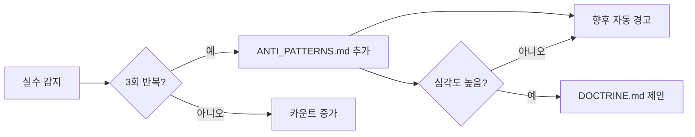

# ANTI_PATTERNS: 반복 실수 방지록

> **실수를 두 번 하지 않기 위한 패턴 라이브러리 v4.0**
>
> 동일한 실수가 3회 반복되면 자동으로 여기에 기록되고,
> 미래에 동일한 패턴이 감지되면 경고를 발생시킵니다.
>
> **멀티 스택 지원**: TypeScript, Dart, Python 공통 + 플랫폼별 패턴

---

## 🚨 감지 시스템

### 트리거 조건

- 동일한 타입의 에러가 3회 반복
- 사용자가 동일한 수정을 3회 요청
- 코드 리뷰에서 동일한 지적이 3회 발생

### 자동 처리



---

## ❌ 코드 수준 Anti-Patterns (범용)

### AP-001: 깊은 상대 경로

**문제**: 3단계 이상 상대 경로 (`../../../`)
**해결**: TS → `@/`, Dart → `package:`, Python → 절대 import
**감지**: `../../../` 또는 동등한 깊은 경로 패턴 발견 시 경고

---

### AP-002: 동적 타입 남용

**문제**: 타입 안전성 훼손

| 언어 | ❌ 금지 | ✅ 대안 |
|------|---------|---------|
| TS | `any` | 구체 타입 / 제네릭 |
| Dart | `dynamic` (무분별) | 명시적 타입 / 제네릭 |
| Python | 타입 힌트 미작성 | `typing` 모듈 |

**감지**: `: any`, `dynamic`, 미타입 함수 시그니처 발견 시 차단

---

### AP-003: 주석 처리된 죽은 코드

**문제**: 10줄 이상 주석 블록
**해결**: 완전히 삭제 (Git 히스토리에 있음)
**감지**: 10줄 이상 연속 주석 발견 시 경고

---

### AP-004: 하드코딩된 비밀정보

**문제**: 소스 코드에 API 키, 패스워드 직접 작성
**해결**: 환경 변수로 격리 (`.env`, `--dart-define`, `.env.local`)
**감지**: `sk-`, `pk-`, `password`, `secret`, `apiKey =` 패턴 발견 시 차단

---

### AP-005: 깊은 중첩 if문

**문제**: 3단계 이상 중첩
**해결**: Guard Clause (Early Return) 패턴
**감지**: 3단계 이상 중첩 시 리팩토링 제안

---

### AP-006: 에러 핸들링 누락

**문제**: 비동기 호출에 에러 처리 없음

| 언어 | ❌ Bad | ✅ Good |
|------|--------|---------|
| TS | `await fetch()` (try 밖) | `try { await fetch() } catch (e) {}` |
| Dart | `await loadData()` (try 밖) | `try { await loadData() } on Exception catch (e) {}` |
| Python | `await client.get()` | `try: await client.get() except Exception as e:` |

---

### AP-007: 거대 파일

**문제**: 단일 파일에 모든 로직 집중
**해결**: 책임에 따라 모듈 분리
**기준**: TS 200줄, Dart 300줄, Python 200줄

---

### AP-008: 프레임워크 생명주기 오용

**문제**: 프레임워크의 생명주기를 무시한 비동기 처리

| 프레임워크 | ❌ Bad | ✅ Good |
|-----------|--------|---------|
| React | `useEffect` 의존성 배열 누락 | exhaustive-deps 준수 |
| Flame | `Future.delayed()` 사용 | `TimerComponent` 사용 |
| Flutter | `initState`에서 직접 `setState` | `WidgetsBinding.addPostFrameCallback` |

---

### AP-009: 불필요한 상태 파생

**문제**: 다른 상태에서 계산 가능한 값을 별도 상태로 관리

| 프레임워크 | ❌ Bad | ✅ Good |
|-----------|--------|---------|
| React | `useState(fullName)` (firstName+lastName) | `const fullName = \`$\{first} $\{last}\`` |
| Riverpod | 별도 Provider로 파생값 관리 | `Provider`에서 `.select()` 또는 getter 사용 |

---

### AP-010: 디버그 출력 커밋

**문제**: 디버그용 출력문 제거 누락

| 언어 | ❌ 금지 | ✅ 대안 |
|------|---------|---------|
| TS | `console.log()` | 제거 또는 logger 사용 |
| Dart | `print()` | `kDebugMode` 가드 또는 `debugPrint` |
| Python | `print()` | `logging` 모듈 사용 |

---

## ❌ 작업 프로세스 Anti-Patterns

### AP-011: 무한 재시도 (Brute Force Retry)

**문제**: 동일한 접근법으로 3회 이상 실패해도 같은 방법 반복
**근본원인**: 에러 메시지를 정확히 분석하지 않음
**해결**: 2회 연속 실패 → 즉시 중단 → 완전히 다른 접근법

---

### AP-012: 컨텍스트 미확인 착수 (Blind Start)

**문제**: 기존 코드를 읽지 않고 바로 구현 시작
**해결**: 관련 파일 먼저 읽기 → 패턴 파악 → 구현

---

### AP-013: 대량 동시 수정 (Shotgun Surgery)

**문제**: 5개 이상 파일을 검증 없이 한 번에 수정
**해결**: 최대 3개 파일씩 → 빌드/타입 체크 → 다음 배치

---

### AP-014: 무비판적 패턴 복사 (Copy-Paste Cargo Cult)

**문제**: 다른 프로젝트/스택의 코드를 맥락 없이 복사
**해결**: 기술 스택 확인 → 의존성 체크 → 프로젝트 컨벤션에 맞게 조정

---

### AP-015: 빌드 검증 생략 (Ship and Pray)

**문제**: 대량 수정 후 빌드 검증 없이 다음 단계 진행
**해결**: 주요 변경 후 빌드/분석/테스트 실행 → 에러 0개 확인

---

## ❌ 게임 개발 Anti-Patterns (Flame/Flutter)

### AP-016: 매 프레임 컬렉션 순회

**문제**: `update(dt)` 내에서 `whereType<T>()`, `children.where()`로 매 프레임 필터링
**근본원인**: 성능 비용 과소평가
**해결**: 캐시된 리스트 유지, 이벤트 기반 업데이트
**감지**: `update()` 내부의 `whereType`, `children.where` 패턴

```dart
// ❌ Bad: 매 프레임 60fps × 적 수만큼 순회
@override
void update(double dt) {
  final enemies = world.children.whereType<BaseEnemy>();
  for (final enemy in enemies) { ... }
}

// ✅ Good: 캐시 리스트 사용
final List<BaseEnemy> _cachedEnemies = [];
void onEnemyAdd(BaseEnemy e) => _cachedEnemies.add(e);
void onEnemyRemove(BaseEnemy e) => _cachedEnemies.remove(e);
```

---

### AP-017: Future.delayed 남용

**문제**: Flame 생명주기 외부에서 `Future.delayed` 사용
**근본원인**: Flame의 타이머 시스템 미인지
**해결**: `TimerComponent` 또는 내부 타이머 사용

```dart
// ❌ Bad
Future.delayed(Duration(seconds: 1), () => doSomething());

// ✅ Good
add(TimerComponent(period: 1.0, removeOnFinish: true, onTick: () => doSomething()));
```

---

### AP-018: 컴포넌트 중복 추가

**문제**: 같은 컴포넌트를 `add()`로 두 번 추가
**근본원인**: 조건 분기 누락, 비동기 타이밍 문제
**해결**: `isMounted` 체크, 또는 `children.any()` 가드

```dart
// ❌ Bad
world.add(waveManager); // 이미 추가된 상태에서 또 추가

// ✅ Good
if (!waveManager.isMounted) world.add(waveManager);
```

---

### AP-019: 매직 넘버 (게임 밸런스)

**문제**: 코드에 직접 숫자 하드코딩 (`hp = 350`, `speed = 80`)
**근본원인**: 빠른 프로토타이핑 후 정리 미실시
**해결**: `GameConstants` 또는 데이터 모델에 중앙 집중

```dart
// ❌ Bad
_cooldownTimer = 8.0;

// ✅ Good
_cooldownTimer = GameConstants.waveCooldown;
```

---

### AP-020: main.dart 비대화

**문제**: `main.dart`에 UI, 게임 초기화, 상태 정의 모두 집중
**근본원인**: 초기 프로토타이핑에서 분리하지 않음
**해결**: 기능별 분리 (`app.dart`, `game_config.dart`, `routes.dart`)
**감지**: `main.dart` 500줄 이상 시 경고

---

### AP-021: const 컨텍스트 내 런타임 메서드 호출

**문제**: `const BoxDecoration(border: Border(...color: AppColors.xxx.withAlpha(50)))` 식으로 `const` 표현 안에서 `.withAlpha()` 등 런타임 메서드를 호출하여 `const_eval_method_invocation` 에러 발생
**근본원인**: `const` 키워드가 상위에서 전체 트리를 const로 강제하면, 하위 자식 어디에서든 런타임 메서드 호출 불가
**해결**:

1. 상위 `const` 키워드 제거
2. 또는 `withAlpha()` 대신 `Color(0xNN...)`으로 직접 ARGB 색상 지정

**감지**: `const` 블록 내 `.withAlpha(`, `.withOpacity(`, `.withRed(`, `.withGreen(`, `.withBlue(` 패턴 발견 시 경고

```dart
// ❌ Bad: const 블록 내 withAlpha()
decoration: const BoxDecoration(
  border: Border(bottom: BorderSide(color: AppColors.pink.withAlpha(50))),
)

// ✅ Good: const 제거
decoration: BoxDecoration(
  border: Border(bottom: BorderSide(color: AppColors.pink.withAlpha(50))),
)
```

**실제 사례**: 아트 디렉션 팔레트 적용 시 3건 발생 (2026-02-24)

---

### AP-022: PowerShell 터미널 출력 잘림

**문제**: `flutter analyze` 등 긴 출력의 명령어가 PowerShell 파이프라인에서 잘려 에러 위치 파악 불가
**근본원인**: PowerShell의 출력 버퍼/인코딩 문제, `2>&1` 리다이렉션 시 폭 제한
**해결**: 결과를 UTF-8 파일로 저장 후 `view_file`로 확인

```powershell
# ❌ Bad: 출력이 잘림
flutter analyze 2>&1 | findstr "error"

# ✅ Good: 파일로 저장 후 읽기
dart analyze lib/target_file.dart 2>&1 | Out-File -Encoding utf8 C:\Temp\result.txt
```

**감지**: 터미널 출력이 잘려 에러 위치를 시각적으로 확인 불가할 때 즉시 파일 저장 전략 전환
**실제 사례**: 아트 디렉션 적용 시 analyze 출력 4회 잘림 (2026-02-24)

---

### AP-023: 반복 래핑 수작업 (Manual Wrapping Repetition)

**문제**: 같은 위젯 래핑 패턴(예: `ClipRRect` + `BackdropFilter`)을 10개 이상 파일에 수작업으로 반복 적용
**근본원인**: 공통 위젯/헬퍼 함수를 먼저 만들지 않고 개별 파일에 직접 적용 시작
**해결**: 3개 이상 동일 래핑 패턴이 예상되면, 먼저 `GlassPanel` 같은 공통 위젯을 만들고 그것을 적용
**감지**: 같은 `ClipRRect` + `BackdropFilter` 또는 유사 래핑 패턴이 3개 이상 파일에 등장 시

```dart
// ❌ Bad: 각 파일마다 수동 래핑 (17회 반복)
ClipRRect(
  borderRadius: BorderRadius.circular(12),
  child: BackdropFilter(
    filter: ImageFilter.blur(sigmaX: 6, sigmaY: 6),
    child: Container(...),
  ),
)

// ✅ Good: 공통 위젯 한 번 만들고 재사용
class GlassPanel extends StatelessWidget {
  final double blur;
  final double radius;
  final Widget child;
  // ...
}
```

**실제 사례**: 글래스모피즘 적용 시 17개 위젯에 동일 패턴 수작업 반복 (2026-02-24)

---

## 📊 통계

### 자주 발생하는 실수 (Top 5)

1. 무한 재시도 (AP-011): 빈도 높음
2. 컨텍스트 미확인 (AP-012): 빈도 높음
3. 반복 래핑 수작업 (AP-023): UI작업 시 빈도 높음 ⭐ NEW
4. const 메서드 호출 (AP-021): Dart에서 빈도 높음
5. 매 프레임 순회 (AP-016): 게임 프로젝트에서 높음

**마지막 업데이트**: 2026-02-24 (v4.2 — AP-023 추가)

---

## 📝 패턴 추가 템플릿

```markdown
### AP-XXX: [문제 요약]

**문제**: [증상]
**근본원인**: [왜 발생하는가]
**해결**: [구체적 해결 방법]
**감지**: [자동 감지 규칙]
**실제 사례**: [발생한 대화 ID 또는 상황]
```
