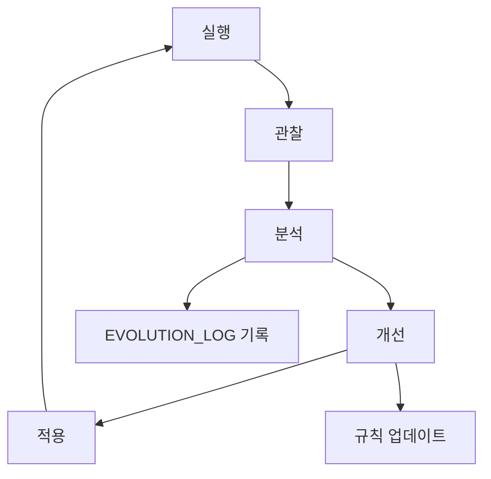

# 자가 진화 워크플로우 (/evolve)

## 🎯 목적

Antigravity가 스스로를 분석하고, 개선점을 찾아, 규칙을 업데이트하는 자율적 진화 프로세스입니다.

---

## 🔔 트리거 조건

다음 중 하나라도 해당되면 이 워크플로우가 자동 실행됩니다:

1. **반복 실수 감지**: 동일한 실수가 3회 반복됨
2. **사용자 피드백**: 사용자가 명시적으로 `/retro` 또는 `/evolve` 호출
3. **주기적 회고**: 매 주말 자동 실행
4. **성능 저하**: 작업 성공률이 80% 아래로 떨어짐
5. **새로운 패턴**: 새로운 성공 패턴 또는 실패 패턴 발견

---

## 📋 진화 단계

### Step 1: 패턴 감지 (Pattern Detection)

```
1. 최근 10개 대화 분석
2. 반복되는 에러 패턴 추출
3. 성공/실패 케이스 분류
4. 통계 생성
```

**도구**:

- 대화 로그 분석
- `ANTI_PATTERNS.md` 검토
- `SUCCESS_PATTERNS.md` 검토

**출력**: 감지된 패턴 목록

---

### Step 2: 공백 분석 (Gap Analysis)

```
1. 현재 DOCTRINE.md 규칙 검토
2. 감지된 패턴과 비교
3. 규칙으로 커버되지 않는 영역 식별
4. 개선 필요 영역 우선순위 설정
```

**질문**:

- 이 실수를 방지하는 규칙이 있는가?
- 규칙은 있지만 너무 모호한가?
- 완전히 새로운 시나리오인가?

**출력**: Gap Report

---

### Step 3: 규칙 제안 (Rule Proposal)

```
1. 새로운 규칙 초안 작성
2. 기존 규칙 수정안 작성
3. Anti-Pattern 추가 또는 업데이트
4. 영향 분석
```

**형식**:

```markdown
## 제안: Rule XX 추가

**문제**: [감지된 패턴]
**제안 규칙**: [새 규칙 내용]
**예시**: [Before/After 코드]
**영향 범위**: [어떤 작업에 영향]
**리스크**: [잠재적 부작용]
```

**출력**: `evolution_proposal.md` 생성

---

### Step 4: 사용자 승인 (User Approval)

```
1. evolution_proposal.md를 사용자에게 제시
2. 변경 사항 명확히 설명
3. 예시와 함께 시각화
4. 승인 대기
```

**사용자 옵션**:

- ✅ 승인: 즉시 적용
- 📝 수정 요청: 제안 조정 후 재검토
- ❌ 거부: 제안 폐기, 이유 기록

**자동 승인 조건** (사용자 설정):

- 마이너 개선 (기존 규칙 명확화)
- Anti-Pattern 추가 (새로운 패턴)
- 문서 개선

---

### Step 5: 자동 업데이트 (Self-Update)

//turbo

```
승인된 변경사항 자동 적용:

1. DOCTRINE.md 업데이트
2. ANTI_PATTERNS.md 업데이트
3. TECH_STACK.md 필요시 업데이트
4. EVOLUTION_LOG.md에 변경 기록
5. 백업 생성 (변경 전 상태)
```

**백업 위치**: `.agent/backups/YYYYMMDD_HHMMSS/`

---

### Step 6: 검증 (Verification)

```
1. 변경된 규칙으로 이전 실패 케이스 재검토
2. 새 규칙이 문제를 해결하는지 확인
3. 의도하지 않은 부작용 체크
4. 검증 결과를 EVOLUTION_LOG.md에 기록
```

**검증 방법**:

- 이전 실패 케이스 재현
- 새 규칙 적용 후 결과 비교
- 성공률 측정

---

## 💡 예시

### 예시 1: 반복 실수 → Anti-Pattern 추가

**감지**:

```
사용자가 3번 연속 "상대 경로 대신절대 경로 사용해줘" 요청
```

**분석**:

```
현재 DOCTRINE Rule 21은 있지만, 자동 감지가 없음
```

**제안**:

```markdown
## 제안: AP-011 추가

**문제**: `../../../` 패턴 반복 사용
**Anti-Pattern**: 
- 감지 규칙: `import.*\.\./\.\.`
- 자동 교체: `@/` 경로로 변환
**자동 수정**: Yes
```

**승인 → 적용**:

- ANTI_PATTERNS.md에 AP-011 추가
- 향후 자동 감지 및 경고

---

### 예시 2: 새로운 베스트 프랙티스 발견

**감지**:

```
사용자가 여러 프로젝트에서 `useDebounce` 훅 재사용
```

**분석**:

```
재사용 가능한 유틸리티이지만 skill로 등록되지 않음
```

**제안**:

```markdown
## 제안: Skill 추가 - React Hooks Library

**문제**: 반복적인 커스텀 훅 구현
**제안**: `.agent/skills/react-hooks/` 생성
**포함 훅**: useDebounce, useThrottle, useLocalStorage
**이점**: 재사용성 향상, 일관된 구현
```

**승인 → 적용**:

- `.agent/skills/react-hooks/` 생성
- EVOLUTION_LOG에 기록

---

## 🚨 안전 장치

### 자동 승인 금지 항목

- DOCTRINE Rule 0 변경 (정체성 관련)
- 보안 규칙 완화
- 기술 스택 메이저 변경
- 200줄 이상 규칙 삭제

### 롤백 메커니즘

```bash
# 변경 롤백
cd .agent/backups/
# 최신 백업 확인
ls -lt | head -1
# 복원
cp -r [backup_dir]/* ../
```

---

## 📊 성과 측정

### 진화 전

- 반복 실수 횟수: X
- 작업 성공률: Y%
- 평균 작업 시간: Z분

### 진화 후

- 반복 실수 횟수: X-n
- 작업 성공률: Y+m%
- 평균 작업 시간: Z-k분

**목표**:

- 반복 실수 50% 감소
- 성공률 10% 향상

---

## 🎓 학습 루프



---

## ⚙️ 설정

### 자동 진화 옵션

```json
{
  "auto_evolve": {
    "enabled": true,
    "auto_approve_minor": true,
    "weekly_review": true,
    "threshold": {
      "repeat_count": 3,
      "success_rate": 0.8
    }
  }
}
```

---

## 🏁 완료 조건

- [ ] 패턴 감지 완료
- [ ] Gap 분석 완료
- [ ] 규칙 제안 생성
- [ ] 사용자 승인 획득
- [ ] 변경사항 적용
- [ ] 검증 완료
- [ ] EVOLUTION_LOG 업데이트
