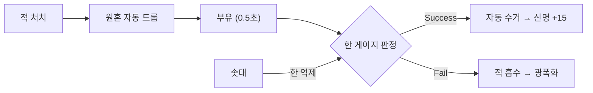

# 🏯 Gateway of Regrets: Soul Defense — 게임 디자인 바이블 (GDD) v4.0

> **Gateway of Regrets — Master Game Design Bible**
> 최종 업데이트: 2026-02-18
> 기술 스택: Flutter + Flame Engine (Dart)
> 레퍼런스: Kingdom Rush, 명일방주(Arknights), 위쳐 3, **케이팝 데몬 헌터스, 쿠키런 킹덤**
> 디자인 원칙: **단순 조작 × 깊은 전략 × 무한 확장 × 중독성**

---

## I. 핵심 철학: "한(恨)의 생태계"

### 1.1. 세계관 한 줄 요약

> 이승과 저승 사이의 **해원문(解冤門)**을 지키는 수호자가 되어,
> 원한을 품은 악귀를 **정화(해원)**하여 저승으로 보내는 한국형 타워 디펜스.

### 1.2. 핵심 차별점

| 기존 TD 게임   | 해원의 문                                           |
| -------------- | --------------------------------------------------- |
| 적을 "죽인다"  | 적을 **"해원(한을 풀어줌)"**하여 승천               |
| 적 처치 = 끝   | 적 처치 → **원혼 드롭** → 정화 or 광폭화            |
| 마나/골드      | **신명(Sinmyeong)** + 곡소리(Wailing) 디버프 게이지 |
| 밤/낮 = 비주얼 | 낮/밤 = **적 타입 + 전략 자체가 변경**              |

### 1.3. 매직 시스템

| 자원                 | 설명                                                                          |
| -------------------- | ----------------------------------------------------------------------------- |
| **신명 (Sinmyeong)** | 인게임 자원. 타워 건설, 스킬 사용, 오브젝트 활성화에 소비 (스테이지 내에서만 사용) |
| **곡소리 (Wailing)** | 적 디버프 게이지. 적이 죽을수록 서서히 상승. 100% 도달 시 아군 타워 공속 -50% |
| **신명석 (Gems)**    | 프리미엄 재화. 스킨 구매, 영웅 해금, 상점 이용에 사용. 광고 시청/업적/과금으로 획득 |
| **금 (Gold)**        | 강화 재화. 타워 영구 업그레이드, 영웅 진화, 재련에 사용. 스테이지 클리어/시즌패스로 획득 |

> **재화 요약**: 신명(인게임) / 신명석(프리미엄) / 금(강화). 3종 재화 체계.

#### 스킨 등급 (7단계)

| 등급 | 코드명      | 한글명 | 이모지 | 특수 효과                    |
| ---- | ----------- | ------ | ------ | ---------------------------- |
| 1    | `common`    | 기본   | ⬜     | —                            |
| 2    | `uncommon`  | 수련   | 🟤     | —                            |
| 3    | `rare`      | 정제   | 🟢     | 테두리 표시                  |
| 4    | `epic`      | 명작   | 🔵     | 테두리 + 약한 오라           |
| 5    | `legendary` | 걸작   | 🟣     | 테두리 + 강한 오라           |
| 6    | `mythic`    | 전설   | 🟠     | 테두리 + 오라 + 파티클       |
| 7    | `divine`    | 한정   | 🟡     | 풀 이펙트 + 시즌 한정 표식   |

### 1.4. 원한의 고리 (Cycle of Resentment) — 자동 수거 설계

> **핵심 원칙**: 원혼은 드롭되면 **자동으로 수거**된다.
> 한(怨) 게이지가 높을수록 수거 실패율이 증가하여 전략적 긴장감 유지.



> **전략적 핵심**: **솟대를 배치하면 한 게이지 증가를 억제**하여 원혼 수거 성공률을 높인다.
> 터치 조작 없이, 타워 배치로 원혼 관리 전략이 완성된다.

---

## I-B. 🎨 아트 디렉션: "팝 코리안 고스트" 스타일

> **레퍼런스**: 케이팝 데몬 헌터스, 쿠키런 킹덤, 명일방주
> **핵심 컨셉**: 세계관은 무겁고 어둡지만, **비주얼은 밝고 귀엽고 팝하게**.
> 이 **갭(Gap)**이 오히려 중독적 매력을 만든다.

### 1-B.1. 디자인 원칙

| 원칙 | 설명 |
| ---- | ---- |
| **어둠 속의 빛** | 저승/악귀라는 무서운 소재를 **밝은 네온 색감**으로 표현 |
| **귀여운 공포** | 악귀도 동글동글, 적도 **위협적이지만 어딘가 귀여운** 디자인 |
| **K-Pop 감성** | 화려한 이펙트, 빛나는 UI, 아이돌 같은 영웅 연출 |
| **한국미 퓨전** | 전통 한복 + 네온 라인, 기와 패턴 + 홀로그램 |

### 1-B.2. 컬러 팔레트 (팝 코리안 고스트 v2)

> **디자인 코드**: `app_colors.dart` — "귀엽고 밝고 따뜻한" 팝 색감
> 어두운 세계관 속 밝은 네온이 돋보이는 구성. 쿠키런 킹덤, 케이팝 몬스터 헌터스 레퍼런스.

#### 메인 팔레트

| 이름 | HEX | Dart 상수 | 용도 |
| ---- | --- | --------- | ---- |
| 🌸 **벚꽃 핑크** | `#FF7EB3` | `cherryBlossom` | 주 컬러. UI 하이라이트, 활성 상태, 영웅 스킬 |
| 🍑 **피치 코랄** | `#FF9A76` | `peachCoral` | 강조. 버튼 그라디언트, 따뜻한 악센트 |
| 💜 **라벤더** | `#C084FC` | `lavender` | 신비/영혼. 원혼, 정화, 밤 모드 |
| 🟡 **신명 골드** | `#FBBF24` | `sinmyeongGold` | 재화. 신명석, 금, 보상 연출 |
| 🌿 **민트 그린** | `#34D399` | `mintGreen` | 힐/버프. 치유, 체력 바, 안전 상태 |
| 🔴 **광폭 레드** | `#EF4444` | `berserkRed` | 위험. 광폭화, 데미지, 경고 |
| 🩵 **하늘 블루** | `#38BDF8` | `skyBlue` | 보조. 물 속성, 웨이브, 쿨타임 |

#### 배경 & 서피스

| 이름 | HEX | Dart 상수 | 용도 |
| ---- | --- | --------- | ---- |
| 기본 스캐폴드 | `#120A1A` | `scaffoldBg` | 가장 어두운 배경 |
| 짙은 자주 | `#150D1E` | `bgDeepPlum` | 하단/깊은 배경 |
| 부드러운 밤색 | `#1E1226` | `bgWarmDark` | 상단 배경 |
| 카드 중간 | `#221730` | `surfaceMid` | 패널/카드 기본 |
| 카드 어두운 | `#1E1528` | `surfaceDark` | 컨테이너 배경 |

#### 타워 속성 컬러

| 타워 | HEX | Dart 상수 |
| ---- | --- | --------- |
| 🏹 궁수탑 | `#34D399` | `towerArcher` |
| 🤼 병사탑 | `#38BDF8` | `towerBarracks` |
| 🔮 무당탑 | `#C084FC` | `towerShaman` |
| 💥 화염탑 | `#FF9A76` | `towerArtillery` |
| 🪬 솟대 | `#FBBF24` | `towerSotdae` |

#### 등급별 컬러 (스킨/아이템)

| 등급 | 이름 | HEX | Dart 상수 |
| ---- | ---- | --- | --------- |
| 1 | 기본 (Common) | `#9CA3AF` | `rarityCommon` |
| 2 | 수련 (Uncommon) | `#34D399` | `rarityUncommon` |
| 3 | 정제 (Rare) | `#38BDF8` | `rarityRare` |
| 4 | 명작 (Epic) | `#C084FC` | `rarityEpic` |
| 5 | 걸작 (Legendary) | `#FBBF24` | `rarityLegendary` |
| 6 | 전설 (Mythic) | `#FF7EB3` | `rarityMythic` |
| 7 | 한정 (Divine) | `#FF6B6B` | `rarityDivine` |

> **그라디언트 프리셋**: `bgGradient`(배경), `primaryGradient`(벚꽃→피치), `purifyGradient`(벚꽃→라벤더), `berserkGradient`(광폭), `rewardGradient`(골드→피치)

### 1-B.3. 캐릭터 스타일

| 구분 | 스타일 | 예시 |
| ---- | ------ | ---- |
| 영웅 | **2.5등신 치비**, 큰 눈, 과장된 표정 | 깨비: 뿔+방망이 든 귀여운 도깨비 |
| 적 (일반) | **동글동글 슬라임형**, 무섭지만 귀여운 | 굶주린 혼: 축 처진 눈의 동그란 유령 |
| 적 (보스) | **3등신**, 위엄 있지만 여전히 팝한 색감 | 시장악귀: 화려한 관복+네온 보라 오라 |
| 타워 | **SD 건축물**, 둥근 모서리, 빛나는 장식 | 화살탑: 귀여운 기와지붕+빛나는 화살 |
| NPC | 2.5등신, 친근한 표정 | 저승 안내자: 귀여운 저승사자 |

> **표정 시스템**: 영웅은 대기/전투/궁극기/피격 시 **4가지 표정 변화**.
> 적도 등장/이동/피격/처치 시 **표정 변화** → 감정 이입 유도.

### 1-B.4. UI 디자인 톤앤매너

| 요소 | 스타일 |
| ---- | ------ |
| 버튼 | **둥근 모서리 (16px radius)**, 글로우 테두리, 그라디언트 배경 |
| 패널 | **반투명 글래스모피즘** (backdrop-blur + 어두운 오버레이) |
| 폰트 | 한글 **둥근 고딕체** (예: Pretendard, 나눔스퀘어라운드) |
| 아이콘 | 라인+필 혼합, 네온 그로우 효과 |
| 전환 | 부드러운 슬라이드/페이드 (200~400ms) |
| 보상 연출 | 별✨ 파티클 + 화면 글로우 + 바운스 애니메이션 |

### 1-B.5. 이펙트 가이드

| 상황 | 이펙트 스타일 | 색상 |
| ---- | ------------- | ---- |
| 정화 (해원) | 꽃🌸 + 빛✨ 파티클 상승 | 보라→핑크 그라디언트 |
| 광폭화 | 불꽃🔥 + 균열 + 진동 | 레드→다크 보라 |
| 영웅 궁극기 | 전체 화면 컷인 + 네온 폭발 | 영웅별 고유 색상 |
| 타워 공격 | 귀엽고 팝한 투사체 | 속성별 색상 |
| 원혼 수거 | 빛나는 구슬이 흡수되는 연출 | 하늘→골드 전환 |
| 웨이브 시작 | 한지 느낌 배너 슬라이드 인 | 골드 테두리 |
| 보스 등장 | 화면 어두워짐 + 네온 눈 등장 | 보라+레드 |

### 1-B.6. 사운드 & BGM 방향

| 요소 | 스타일 |
| ---- | ------ |
| BGM | **국악 악기 + 일렉트로닉 비트**. 가야금/대금 멜로디 + 신스 베이스 |
| 전투 BGM | 빠른 BPM (140~160), 긴장감 있지만 **통통 튀는 느낌** |
| 보스전 BGM | 묵직한 북 + 드롭 베이스, 보컬 샤우팅 |
| 정화 SE | "띠링~" 맑은 풍경 소리 + 화음 |
| 광폭화 SE | 낮은 울음소리 + 왜곡 효과 |
| UI SE | 팝한 클릭음, 경쾌한 전환음 |

> **레퍼런스 BGM 느낌**: 이날치 밴드 × EDM. 전통+현대의 융합.

---

## II. 세계관 구조: 20시즌 무한 확장 로드맵

> **설계 원칙**: 한 유저가 **수 년을 플레이**할 수 있도록 콘텐츠가 **천천히, 꾸준히** 확장.
> 시즌당 에피소드 5개, 에피소드당 **20스테이지** = 시즌당 **100스테이지**.
> 급하게 많이 풀지 않고, **3~4개월에 시즌 1개씩** 점진적 업데이트.

### 2.1. 시즌 1: 이승편 (Launch)

```markdown
[Handover to @Designer]
1. 목표: Glassmorphism 디자인 적용
2. 참고: 컬러 팔레트 (팝 코리안 고스트 v2) 및 UI 디자인 톤앤매너 섹션
3. 요청: 각 UI 요소별 (버튼, 패널, 아이콘 등) 구체적인 글래스모피즘 적용 예시 및 가이드라인 추가
4. 기한: 2026-03-01
```

```
[변두리 마을] → [깊은 산] → [얼굴 없는 숲] → [왕궁] → [저승의 입구]
     Ep.1          Ep.2          Ep.3        Ep.4
```

> "마스터, 날씨가 심상치 않네요. 전략을 수정해야 할 것 같아요!"

| Ep.   | 이름               | 테마             | 적 성격      | 스테이지   |
| ----- | ------------------ | ---------------- | ------------ | ---------- |
| **1** | 굶주린 자들의 장터 | 기근, 역병       | 1차원적 욕망 | 1-1 ~ 1-20 |
| **2** | 통곡하는 숲        | 산짐승, 자연재해 | 자연의 분노  | 2-1 ~ 2-20 |
| **3** | 얼굴 없는 숲       | 변이, 기괴함     | 고지능 악의  | 3-1 ~ 3-20 |
| **4** | 왕궁의 그림자      | 정치적 음모      | 권력과 배신  | 4-1 ~ 4-20 |
| **5** | 저승의 문턱        | 최종 결전        | 저승 존재    | 5-1 ~ 5-20 |

> **에피소드당 20스테이지** 구성:
>
> - **1~5**: 튜토리얼/입문 (새 적 소개)
> - **6~10**: 보통 난이도 (조합 학습)
> - **11~15**: 어려움 (밤 스테이지 등장)
> - **16~19**: 극한 (복합 기믹)
> - **20**: 에피소드 보스전

#### 2.1.1. 튜토리얼 설계 (1-1 ~ 1-5 학습 시나리오)

> **설계 원칙**: 텍스트 튜토리얼 최소화. **"해보면서 배우기"** 방식.
> 각 스테이지에 **딱 하나의 새 메카닉**만 소개하여 인지 부하를 줄인다.
> 실패해도 괜찮도록 **1-1~1-3은 패배 불가** 설계 (적 HP/속도 극도로 낮음).

| 스테이지 | 주제 | 학습 목표 | 해금 시스템 | 힌트 UX |
| -------- | ---- | --------- | ----------- | ------- |
| **1-1** 🔰 | 첫 번째 해원 | 타워 배치의 기초. 지정 위치에 **화살탑 1개** 배치 → 느린 적 3마리 처치 | 화살탑만 사용 가능 | 손가락 아이콘으로 배치 위치 안내 |
| **1-2** 🔰 | 길을 막아라 | 다중 배치. **화살탑 2~3개**를 자유롭게 배치 → 적 5마리 (2웨이브) | 타워 판매 해금 | "타워를 여러 곳에 배치해보세요!" |
| **1-3** 🔰 | 불의 세례 | 새 타워 소개. **화염탑** 해금 + 속성 데미지 첫 체험 (풀밭 적에게 효과적) | 화염탑 해금 | "적에게 약점이 있어요! 불꽃을 써보세요" |
| **1-4** | 성장하는 수호자 | 타워 업그레이드 학습. 기존 타워를 **레벨 2로 업그레이드** → 강화된 적 등장 | 타워 업그레이드 해금 | "신명이 모이면 타워를 강화하세요!" |
| **1-5** | 원혼의 목소리 | 원혼 시스템 학습. 적 처치 → **원혼 드롭** 관찰 + **솟대** 첫 배치 | 솟대 해금, 영웅 깨비 참전 | "원혼이 떠돌아요... 솟대를 세워 정화하세요" |

> **1-5 클리어 보상**: 영웅 **깨비(도깨비)** 정식 합류 + 신명석 50개 + 화염탑 영구 해금
>
> **튜토리얼 후 해금 상태** (1-6 시작 시):
>
> - 타워: 화살탑, 화염탑, 솟대 (3종)
> - 영웅: 깨비 1명
> - 시스템: 배치, 판매, 업그레이드, 원혼 정화
> - 미해금: 번개탑(1-8), 얼음탑(1-12), 독안개탑(1-16), 영웅 스킬(1-10)

#### 2.1.2. 에피소드 전환 내러티브 (Episode Transitions)

> **설계 원칙**: 챕터(20스테이지) 클리어 후 다음 지역으로 넘어갈 때 보여주는 **1줄 내러티브**.
> 플레이어에게 다음 시련에 대한 **기대감과 위기감**을 동시에 심어준다.

| 전환 지점 | 타이틀 | 내러티브 텍스트 | 다음 지역 힌트 |
| :--- | :--- | :--- | :--- |
| **Ep.1 → Ep.2** | 산을 흔드는 통곡 | "장터의 아귀들은 조용해졌지만, 산 너머에서 들려오는 저 짐승들의 통곡소리는 무엇인가?" | **산군(山군)**의 위협, 지형 고저차 증가 |
| **Ep.2 → Ep.3** | 지워진 얼굴들 | "산군의 위엄도 원한을 막진 못했다. 하지만 안개가 자욱해지며 숲의 얼굴이 지워지고 있다." | **안개 기믹**, 은신 적 등장 |
| **Ep.3 → Ep.4** | 왕궁의 긴 그림자 | "안개 속의 괴물들을 정화했지만, 소문이 들려온다. 왕궁의 그림자가 이 모든 혼란의 배후라고." | **권력의 타락**, 자객 및 마법 면역 적 |
| **Ep.4 → Ep.5** | 열려버린 귀문 | "왕궁의 타락을 씻어냈으나, 이승의 힘으론 더 이상 막을 수 없는 거대한 뒤틀린 문이 열렸다." | **최종 결전**, 저승사자 및 초거대 보스 |

### 2.2. 20시즌 장기 로드맵

> **업데이트 주기**: 시즌당 **3~4개월**. 느리지만 꾸준히. 유저가 질리지 않도록.

| 시즌    | 제목       | 시대/컨셉             | 신규 콘텐츠                              | 예상 출시 |
| ------- | ---------- | --------------------- | ---------------------------------------- | --------- |
| **S1**  | 이승편     | 조선 변두리~저승 입구 | Ep.1~5 (100스테이지), 영웅 5인, 타워 5종 | 런칭      |
| **S2**  | 저승편     | 저승 10왕 탐험        | Ep.6~10, 영웅 2인, 저승 타워 변형        | +4개월    |
| **S3**  | 삼국편     | 고구려/백제/신라      | Ep.11~15, 역사 영웅 3인, 공성전 모드     | +4개월    |
| **S4**  | 신화편     | 단군~환웅~곰녀        | Ep.16~20, 신급 적, 천상 타워 변형        | +4개월    |
| **S5**  | 고려편     | 무신정권, 몽골 침입   | Ep.21~25, 무인 영웅, 공성무기            | +3개월    |
| **S6**  | 임진왜란편 | 이순신, 의병          | Ep.26~30, 해전 스테이지, 거북선 타워     | +3개월    |
| **S7**  | 구미호전   | 여우비, 환상의 숲     | Ep.31~35, 변신 적, 환상 기믹             | +3개월    |
| **S8**  | 수궁편     | 용궁, 바다 속         | Ep.36~40, 수중 맵, 용왕                  | +3개월    |
| **S9**  | 도깨비편   | 도깨비 나라           | Ep.41~45, 도깨비 변형, 방망이 시스템     | +3개월    |
| **S10** | 선비편     | 과거시험, 서원        | Ep.46~50, 학문 기반 타워, 문관 영웅      | +3개월    |
| **S11** | 산신편     | 태백산/지리산 산신령  | Ep.51~55, 산악 맵, 호랑이 동맹           | +3개월    |
| **S12** | 풍수편     | 명당, 용맥            | Ep.56~60, 지형 변환 기믹, 풍수 타워      | +3개월    |
| **S13** | 홍길동편   | 의적, 활빈당          | Ep.61~65, 함정 시스템, 의적 영웅         | +3개월    |
| **S14** | 춘향편     | 남원, 사또            | Ep.66~70, 정의/부패 양면 기믹            | +3개월    |
| **S15** | 흥부놀부편 | 박타는 세계           | Ep.71~75, 랜덤 보상 강화, 운명 기믹      | +3개월    |
| **S16** | 별주부전   | 토끼와 자라           | Ep.76~80, 협상/속임수 기믹               | +3개월    |
| **S17** | 천상편     | 옥황상제, 선녀        | Ep.81~85, 천상 맵, 천상 무기             | +3개월    |
| **S18** | 귀문관편   | 최종 귀문             | Ep.86~90, 이계 혼합, 차원 균열           | +3개월    |
| **S19** | 윤회편     | 환생의 수레바퀴       | Ep.91~95, 뉴게임+ 기믹, 전생 영웅        | +3개월    |
| **S20** | 해원편     | 모든 한 풀이          | Ep.96~100, 최종 해원, 엔딩 + 엔드리스    | +3개월    |

> **총 계획**: 100에피소드 × 20스테이지 = **2,000스테이지**
> **총 소요**: 약 **5년**간 꾸준히 콘텐츠 추가
> **매 시즌**: 신규 영웅 1~3인, 신규 적 6~10종, 한정 스킨 세트

### 2.3. 시즌 업데이트 원칙

| 원칙              | 설명                                                       |
| ----------------- | ---------------------------------------------------------- |
| **급하지 않게**   | 시즌 사이 3~4개월 간격. 유저가 현재 시즌을 충분히 즐기도록 |
| **미리 예고**     | 다음 시즌 티저를 2주 전부터 게임 내 공개                   |
| **영구 보존**     | 이전 시즌 스테이지는 항상 플레이 가능                      |
| **점진적 난이도** | 시즌이 올라갈수록 서서히 복잡→후반 시즌은 고수 전용        |
| **한정 콘텐츠**   | 시즌 한정 스킨/이벤트는 재출시 가능 (1년 후)               |

### 2.4. 상시 콘텐츠 (시즌 무관)

| 모드            | 설명                                        | 중독성 포인트       |
| --------------- | ------------------------------------------- | ------------------- |
| **무한의 탑**   | 끝없이 올라가는 층수. 매주 랭킹 초기화      | 매주 도전 동기 부여 |
| **일일 도전**   | 매일 새로운 제약 (타워 1종만, 영웅 없이 등) | 매일 접속 유도      |
| **보스 러쉬**   | 역대 보스 연속 격파. 타임어택               | 숙련 플레이어 만족  |
| **이벤트 시즌** | 명절(추석/설날/단오) 한정 스테이지+스킨     | 시즌 한정 수집욕    |
| **길드 레이드** | (S3 이후) 길드원 협동 보스전                | 소셜 유대감         |

---

## III. 타워 시스템: 5종 "신격화(Deification)" 체계

> Kingdom Rush(4종)를 넘어서는 **5종 타워 체계**.
> 한국 고유의 **화차/신기전**(포병)과 **솟대/성황당**(정화 지원)을 별도 카테고리로 독립.
> 각 타워는 **업그레이드 시 비주얼이 완전히 변신**하며, **개인 스킨**을 장착 가능.

### 3.0. 타워 종류 한눈에 보기

| #   | 타워명                 | 역할            | 데미지 타입    | 핵심 키워드             |
| --- | ---------------------- | --------------- | -------------- | ----------------------- |
| 1   | **궁수탑** (산적 초소) | 원거리 물리 DPS | Physical       | 빠른 연사, 대공         |
| 2   | **병영** (씨름터)      | 근접 소환/길막  | Physical       | 블로킹, 1:1 제압        |
| 3   | **마법탑** (서당)      | 마법 데미지     | Magical        | 영혼 특효, 디버프       |
| 4   | **화포탑** (화차)      | 광역 물리 폭발  | Physical (AoE) | 뭉친 적 처리, 공성      |
| 5   | **솟대** (솟대)        | 지원/수호/버프  | Guardian       | 수호결계, 한 억제, 버프 |

---

### 3.1. 🏹 궁수탑 계열: 산적 초소

> 빠른 연사와 대공(비행 적) 요격에 특화. 물리 데미지.

| 티어 | 이름      | 비용 | 데미지 | 사거리 | 공속  | 특수 |
| ---- | --------- | ---- | ------ | ------ | ----- | ---- |
| 1    | 산적 초소 | 50   | 15     | 150    | 1.5/s | —    |
| 2    | 의병 망루 | +100 | 25     | 170    | 1.8/s | —    |
| 3    | 호국 망루 | +160 | 40     | 200    | 2.0/s | —    |

**Tier 4 분기 선택:**

| 분기  | 이름                           | 비용 | 컨셉             | 핵심 능력                                                     |
| ----- | ------------------------------ | ---- | ---------------- | ------------------------------------------------------------- |
| **A** | 🚀 **신기전 (Rocket Battery)** | +300 | 조선 다연발 로켓 | 광역 폭발, 사거리 250, 스킬: 대신기전(화면 전체 타격)         |
| **B** | 🏹 **신궁 (Spirit Hunter)**    | +300 | 최종병기 활      | 단일 극딜 100, 관통, 은신 감지, 스킬: 부적 화살(적 이동 불가) |

---

### 3.2. ⚔️ 병영 계열: 씨름터

> 병사 소환으로 적의 진로를 차단(Blocking). 근접 물리.

| 티어 | 이름      | 비용 | 데미지 | 사거리 | 공속  | 특수          |
| ---- | --------- | ---- | ------ | ------ | ----- | ------------- |
| 1    | 씨름터    | 70   | 10     | 80     | 0.8/s | 병사 3명 소환 |
| 2    | 무관청    | +120 | 18     | 90     | 1.0/s | 병사 HP 증가  |
| 3    | 수호 전당 | +200 | 28     | 100    | 1.2/s | 병사 4명      |

**Tier 4 분기 선택:**

| 분기  | 이름                               | 비용 | 컨셉                | 핵심 능력                                                             |
| ----- | ---------------------------------- | ---- | ------------------- | --------------------------------------------------------------------- |
| **A** | 🗿 **천하대장군 (General Totem)**  | +350 | 마을 입구 거대 장승 | 무한 HP 장승 1기가 직접 길막, 스킬: 겁주기(적 도주)                   |
| **B** | 👹 **도깨비 씨름판 (Goblin Ring)** | +350 | 도깨비 씨름         | 도깨비 3마리가 적을 들어 메침, 즉사 확률, 스킬: 금나와라뚝딱(골드 ×2) |

---

### 3.3. 🔮 마법탑 계열: 서당

> 마법(영적) 데미지. 물리 면역 적 처리 및 디버프.

| 티어 | 이름   | 비용 | 데미지 | 사거리 | 공속  | 특수           |
| ---- | ------ | ---- | ------ | ------ | ----- | -------------- |
| 1    | 서당   | 100  | 30     | 120    | 1.0/s | 마법 데미지    |
| 2    | 부적집 | +140 | 50     | 140    | 1.2/s | —              |
| 3    | 신당   | +220 | 75     | 160    | 1.3/s | 정화 공격 겸용 |

**Tier 4 분기 선택:**

| 분기  | 이름                                 | 비용 | 컨셉           | 핵심 능력                                                         |
| ----- | ------------------------------------ | ---- | -------------- | ----------------------------------------------------------------- |
| **A** | 🪘 **만신전 (Shaman Temple)**        | +400 | 만신의 굿판    | 광역 DoT + 마법 저항 감소, 스킬: 작두타기(주변 공속 +100%)        |
| **B** | 💀 **저승사자 출장소 (Grim Reaper)** | +400 | 검은 갓의 차사 | HP 30% 이하 즉사, 스킬: 사자의 부름(죽은 적을 아군 유령으로 부활) |

---

### 3.4. 💥 화포탑 계열: 화차 ⭐ NEW

> **Kingdom Rush의 포병(Artillery)**에 해당. 조선시대 화차/비격진천뢰를 모티브로 한 **광역 물리 폭발**.
> 느린 공속이지만 뭉친 적을 한 번에 쓸어버린다.

| 티어 | 이름         | 비용 | 데미지    | 사거리 | 공속  | 특수                  |
| ---- | ------------ | ---- | --------- | ------ | ----- | --------------------- |
| 1    | 화차         | 90   | 25 (범위) | 130    | 0.6/s | 스플래시 반경 40      |
| 2    | 비격진천뢰포 | +130 | 45 (범위) | 150    | 0.7/s | 착탄 시 잔류 화염 2초 |
| 3    | 불랑기포     | +200 | 70 (범위) | 170    | 0.8/s | 스플래시 반경 60      |

**Tier 4 분기 선택:**

| 분기  | 이름                           | 비용 | 컨셉                    | 핵심 능력                                                                    |
| ----- | ------------------------------ | ---- | ----------------------- | ---------------------------------------------------------------------------- |
| **A** | 🐉 **화룡 (Fire Dragon)**      | +380 | 화룡 모양 대포          | 직선 관통 화염 (경로 전체 불바다), 스킬: 화룡점정(보스급에 고정 3000 데미지) |
| **B** | ⚡ **천뢰 (Heavenly Thunder)** | +380 | 번개를 부르는 제천 무기 | 번개 체인 공격 (최대 5체 연쇄), 스킬: 벽력일섬(광역 스턴 3초)                |

---

### 3.5. 🕊️ 솟대 계열: 수호결계 타워 ⭐ REWORKED

> **이 게임만의 독창적 타워**. 직접 적을 공격하지 않고, **수호결계(디버프 내성) + 한 억제 + 아군 버프**를 담당.
> 원혼 수거 성공률을 간접적으로 높이는 전략적 핵심.

| 티어 | 이름      | 비용 | 효과 반경 | 특수                                       |
| ---- | --------- | ---- | --------- | ------------------------------------------ |
| 1    | 솟대      | 60   | 100       | 디버프 내성 50%, 한 게이지 증가 -30%       |
| 2    | 성황당    | +100 | 120       | 디버프 내성 70%, +아군 공속 +15%           |
| 3    | 해원 제단 | +180 | 150       | 디버프 내성 90%, +범위/버프 범위 +30%/+50% |

**Tier 4 분기 선택:**

| 분기  | 이름                                 | 비용 | 컨셉                | 핵심 능력                                                                      |
| ----- | ------------------------------------ | ---- | ------------------- | ------------------------------------------------------------------------------ |
| **A** | 🦅 **수호신단 (Guardian Shrine)**    | +350 | 수호신을 모신 제단  | 디버프 면역 + 한 억제 50%, 스킬: 수호의 날개(전장 타워 디버프 해제)            |
| **B** | 🌾 **지신제단 (Earth Spirit Altar)** | +350 | 땅의 신을 모신 제단 | 범위 내 적 공격력 -20% + 감속 오라, 스킬: 지신밟기(범위 내 적 마법 저항 0으로) |

---

### 3.6. 타워 시너지 매트릭스

| 조합            | 효과                                     | 전략적 의미                        |
| --------------- | ---------------------------------------- | ---------------------------------- |
| 병영 + 화포     | 병사가 적을 묶고 화포가 뭉친 적 일소     | Kingdom Rush 기본 전략의 한국 버전 |
| 궁수 + 솟대     | 궁수 손실 없이 디덤, 솟대 버프로 공속 괹 | 안정적 디포 + 한 억제 전략         |
| 마법 + 저승사자 | 마법이 HP 깎고 → 저승사자가 즉사 마무리  | 보스/탱커 킬 조합                  |
| 솟대 + 병영     | 솟대의 버프 + 병사의 블로킹              | 방어 요충지 조합                   |
| 화포 + 마법     | 화포 화염 + 마법 디버프 = 극대화         | 물량 웨이브 대응                   |

---

## IV. 적(Enemy) 설계: 챕터별 6종 + 보스

### 4.1. 적 역할 분류 (아키타입)

모든 챕터는 이 6가지 역할을 반드시 포함:

| 역할              | 설명                         | 카운터                     |
| ----------------- | ---------------------------- | -------------------------- |
| **기본형**        | 표준 적. 튜토리얼 대상       | 모든 타워                  |
| **물량/속도형**   | 빠르고 약함. 떼로 돌격       | 화포(AoE), 병영(블록)      |
| **탱커형**        | 느리고 HP 극대. 2페이즈 보유 | 마법(감소), 저승사자(즉사) |
| **비행/원거리형** | 공중 이동. 지상 병사 무시    | 궁수(대공), 신궁(감지)     |
| **특수/은신형**   | 은신 or 면역 기믹            | 영웅(차단), 솟대(감지)     |
| **🔴 보스**       | 챕터 보스. 고유 기믹         | 복합 전략 필요             |

---

### 4.2. 챕터 1: 굶주린 자들의 장터

> 테마: 기근과 역병으로 버려진 마을. '먹는 것'에 집착하는 귀신들.

| #   | ID                | 이름      | 역할      | HP   | 속도 | 아머 | 기믹                        |
| --- | ----------------- | --------- | --------- | ---- | ---- | ---- | --------------------------- |
| 1   | `hungryGhost`     | 아귀      | 기본      | 35   | 45   | 영혼 | 죽을 때 신명 3 훔침         |
| 2   | `strawShoeSpirit` | 짚신 귀신 | 물량/속도 | 25   | 80   | 영혼 | 회피 30%, 떼로 등장         |
| 3   | `burdenedLaborer` | 무지기    | 탱커      | 350  | 30   | 물리 | 사망 시 아귀 3마리 스폰     |
| 4   | `maidenGhost`     | 손각시    | 비행/지원 | 120  | 50   | 영혼 | 비행, 비명 → 타워 공속 -50% |
| 5   | `eggGhost`        | 달걀귀신  | 은신/특수 | 150  | 45   | 영혼 | 영웅 차단 전 공격 불가      |
| 🔴  | `bossOgreLord`    | 두억시니  | **보스**  | 3000 | 25   | 요괴 | 지진 → 전체 기절 3초        |

**보스 공략**: 몽둥이로 땅을 내려칠 때 영웅을 빼거나 바리의 무적 스킬 사용.

---

### 4.3. 챕터 2: 통곡하는 숲

> 테마: 호랑이와 산짐승, 자연재해로 죽은 자들이 모인 깊은 산속.

| #   | ID                 | 이름     | 역할      | HP   | 속도 | 아머 | 기믹                        |
| --- | ------------------ | -------- | --------- | ---- | ---- | ---- | --------------------------- |
| 1   | `tigerSlave`       | 창귀     | 기본      | 130  | 60   | 영혼 | 피격 시 호랑이 영물 소환    |
| 2   | `fireDog`          | 불개     | 비행      | 100  | 80   | 요괴 | 비행, 타워에 DoT (화상)     |
| 3   | `shadowGolem`      | 그슨대   | 마법 탱커 | 400  | 30   | 영혼 | **물리 면역** → 마법만 유효 |
| 4   | `oldFoxWoman`      | 노구화호 | 디버퍼    | 160  | 50   | 요괴 | 영웅 현혹 (아군 타워 공격)  |
| 5   | `failedDragon`     | 강철이   | 돌격      | 250  | 120  | 요괴 | 초고속 돌진, 경로에 독구름  |
| 🔴  | `bossMountainLord` | 산군     | **보스**  | 5000 | 20   | 요괴 | 포효 → 안개(사거리 ÷2)      |

**보스 공략**: 산군이 포효하면 맵 전체 안개. 솟대의 밝히기 기능이나 횃불 오브젝트로 시야 확보 필수.

---

### 4.4. 챕터 3: 얼굴 없는 숲

> 테마: 안개 자욱한 숲. 고지능적 악의를 가진 기괴한 변이 귀신들.

| #   | ID                  | 이름        | 역할      | HP   | 속도 | 아머 | 기믹                        |
| --- | ------------------- | ----------- | --------- | ---- | ---- | ---- | --------------------------- |
| 1   | `changGwiEvolved`   | 진화 창귀   | 기본+     | 200  | 55   | 영혼 | 유혹: 타워 3초 정지         |
| 2   | `saetani`           | 새타니      | 비행+     | 80   | 90   | 영혼 | 불운: 타워 빗나감 50%       |
| 3   | `shadowChild`       | 그림자 아이 | 분열      | 120  | 50   | 영혼 | 죽으면 절반 HP 2마리로 분열 |
| 4   | `maliciousBird`     | 살조        | 공중 러쉬 | 60   | 100  | 영혼 | 죽을 때 깃털 → 영웅 HP 감소 |
| 5   | `faceStealerGhost`  | 얼굴도둑    | 반사/면역 | 200  | 40   | 영혼 | 처음 맞은 속성에 면역 획득  |
| 🔴  | `bossGreatEggGhost` | 대왕 달걀   | **보스**  | 8000 | 15   | 영혼 | 병사 삼킴 → 적으로 배출     |

**보스 공략**: 병영 타워의 병사를 삼키므로 병영 배치 금지. 원거리(궁수+화포) + 강림의 호명 즉사 조합으로 처리.

---

### 4.5. 챕터 4: 왕궁의 그림자

> 테마: 왕궁 내부의 권력 타락. 암살, 부패, 저주가 만연한 정치 귀신들.

| #   | ID                 | 이름       | 역할       | HP    | 속도 | 아머 | 기믹                                          |
| --- | ------------------ | ---------- | ---------- | ----- | ---- | ---- | --------------------------------------------- |
| 1   | `courtAssassin`    | 자객       | 은신/기습  | 380   | 65   | 영혼 | 은신 후 기습 (첫 타격 ×2)                      |
| 2   | `corruptOfficial`  | 탐관       | 버퍼/탱커  | 900   | 28   | 물리 | 주변 적 공격력 +30%, 타워 공속 -30%            |
| 3   | `royalGuardGhost`  | 금위영혼   | 탱커       | 1200  | 32   | 물리 | HP 40% 이하 → 방패 활성 (피해 60% 감소)        |
| 4   | `curseScribe`      | 저주서생   | 비행/디버프 | 280   | 55   | 영혼 | 비행, 타워 3초간 침묵 (공격 불가)               |
| 5   | `puppetDancer`     | 꼭두각시   | 분열       | 450   | 45   | 요괴 | 사망 시 자객 2마리 스폰                        |
| 🔴  | `bossTyrantKing`   | 폭군왕     | **보스**   | 15000 | 15   | 요괴 | 칙령 → 랜덤 타워 3개 10초 사용 불가, 자객 소환 |

**보스 공략**: 칙령으로 핵심 타워가 무력화되므로 **타워를 분산 배치**해야 함. 자객 스폰에 대응하기 위해 솟대+병영 조합 필수. 미호의 여우구슬로 소환된 자객 일소.

---

### 4.6. 챕터 5: 저승의 문턱

> 테마: 이승과 저승의 경계. 사후 세계의 존재들이 문을 열고 쏟아져 나온다.

| #   | ID                    | 이름       | 역할       | HP    | 속도 | 아머 | 기믹                                        |
| --- | --------------------- | ---------- | ---------- | ----- | ---- | ---- | ------------------------------------------- |
| 1   | `underworldMessenger` | 사자       | 속도/즉사  | 500   | 90   | 영혼 | 회피 35%, HP 20% 이하 아군 즉사              |
| 2   | `wailingBanshee`      | 이승혼     | 비행/특수  | 250   | 70   | 영혼 | 비행, 곡소리 게이지 +5%                      |
| 3   | `boneGolem`           | 해골장군   | 초탱커     | 2000  | 22   | 물리 | HP 50% 이하 → 물리 피해 70% 감소             |
| 4   | `soulChainGhost`      | 쇠사슬귀   | CC         | 600   | 40   | 영혼 | 영웅 5초간 이동 불가 (족쇄)                   |
| 5   | `infernoSpirit`       | 업화귀     | 광역 DoT   | 350   | 55   | 요괴 | 아군 타워에 광역 DoT (8 데미지/4초)           |
| 🔴  | `bossGatekeeper`      | 귀문관     | **보스**   | 25000 | 12   | 요괴 | 귀문개방(모든 챕터 적 랜덤 소환), 최강 타워 파괴 |

**보스 공략**: 모든 챕터의 적을 소환하므로 **상성 대응이 완벽한 배치** 필요. 가장 강한 타워를 파괴하므로 **주력 타워를 2세트** 준비. 바리의 씻김굿으로 아군 생존 유지하며 장기전.

---

### 4.7. 적 챕터 간 진화 시스템 (Deepening of Han)

같은 종류의 적이 챕터별로 **원한이 깊어져** 변이한다:

| 적           | Lv 1 (Ch.1)                        | Lv 2 (Ch.2)               | Lv 3 (Ch.3)                   | Lv 4 (Ch.4)                  | Lv 5 (Ch.5)                  |
| ------------ | ---------------------------------- | ------------------------- | ----------------------------- | ----------------------------- | ----------------------------- |
| **창귀**     | 호랑이 가죽 귀신, 죽으면 이속 버프 | 육혼: 타워 3초 정지 유혹  | 호식총: 파괴 시 광폭 호랑이   | 자객: 은신+기습 ×2 데미지     | —                             |
| **새타니**   | 공중, 빠르고 약함                  | 태자귀: 점괘로 빗나감 50% | 괴조: 광역 스턴 + 깃털 데미지 | 저주서생: 비행+타워 침묵       | 이승혼: 곡소리 게이지 상승    |
| **달걀귀신** | 은신, 영웅만 감지                  | 무면귀: 첫 속성 면역 획득 | 대왕 달걀: 병사 삼킴          | —                             | —                             |
| **무지기**   | 느린 탱커, 사망시 스폰             | 그슨대: 물리 면역          | —                             | 금위영혼: 방패+방어 버프       | 해골장군: 물리 70% 감소       |
| **아귀**     | 기본형, 마나 흡수                  | —                          | —                             | 탐관: 주변 적 강화             | 업화귀: 광역 DoT              |

> **플레이어 체감**: "내가 알던 그 놈이 아닌데?" → 매 챕터 긴장감 유지

---

## V. 영웅 시스템: "업보와 해탈"

### 5.1. 5인 영웅 상세

| #   | 영웅     | 원형     | 역할      | 스킬                             | CD   |
| --- | -------- | -------- | --------- | -------------------------------- | ---- |
| 1   | **깨비** | 도깨비   | 탱커/넉백 | 뒤집기 (적을 뒤로 던짐)          | 8초  |
| 2   | **미호** | 구미호   | 마법 딜러 | 여우구슬 (광역 화상 + 마나 회복) | 12초 |
| 3   | **강림** | 저승차사 | 저격수    | 호명 (HP 30% 이하 즉사)          | 15초 |
| 4   | **수아** | 물귀신   | CC/특수   | 발목 잡기 (범위 이속 -90%)       | 10초 |
| 5   | **바리** | 바리데기 | 서포터    | 씻김굿 (아군 공속 ×2, 3초)       | 14초 |

### 5.2. 시즌별 영웅 확장 로스터 (총 50+ 영웅)

> **원칙**: 시즌마다 **1~3명** 신규 영웅 추가. 한국 설화/역사 전체를 커버.
> 5년간 **50명 이상** → 수집욕 + 조합 전략 폭발적 증가.

| 시즌    | 신규 영웅  | 원형          | 역할           | 대표 스킬                            |
| ------- | ---------- | ------------- | -------------- | ------------------------------------ |
| **S1**  | **깨비**   | 도깨비        | 탱커/넉백      | 뒤집기 (적 넉백)                     |
|         | **미호**   | 구미호        | 마법 딜러      | 여우구슬 (광역 화상)                 |
|         | **강림**   | 저승차사      | 저격수         | 호명 (HP 30% 이하 즉사)              |
|         | **수아**   | 물귀신        | CC/특수        | 발목 잡기 (이속 -90%)                |
|         | **바리**   | 바리데기      | 서포터         | 씻김굿 (아군 공속 ×2)                |
| **S2**  | **월하**   | 저승 선녀     | 힐러/디버퍼    | 천도 (적 약화 + 아군 회복)           |
|         | **해태**   | 해태          | 탱커/파괴      | 화재진압 (방어 무시 돌진)            |
| **S3**  | **주몽**   | 고구려 시조   | 원거리 딜러    | 천궁 (3연발 관통 화살)               |
|         | **선화**   | 신라 선화공주 | 서포터/CC      | 서동요 (적 아군화 3초)               |
|         | **연개**   | 연개소문      | 탱커/리더      | 천리장성 (임시 벽 생성)              |
| **S4**  | **단군**   | 단군왕검      | 제왕/올라운더  | 홍익인간 (맵 전체 버프)              |
|         | **웅녀**   | 곰녀          | 변신 딜러      | 곰 변신 (광역 스매시)                |
| **S5**  | **무학**   | 무학대사      | 마법/서포트    | 풍수 (지형 변환 버프)                |
|         | **최영**   | 최영 장군     | 근접 딜러      | 정의의 칼 (크리티컬 ×3)              |
| **S6**  | **이순신** | 충무공        | 광역 딜러      | 학익진 (V자 광역 포격)               |
|         | **논개**   | 의기 논개     | 자폭/CC        | 포옹 (적+자신 동시 제거 → 부활)      |
|         | **사명**   | 사명대사      | 마법/탱커      | 금강역사 (마법 방벽)                 |
| **S7**  | **여우비** | 여우비 정령   | 마법 딜러      | 환영 (분신 3개 생성)                 |
|         | **두꺼비** | 두꺼비 신선   | 탱커/독        | 독안개 (광역 중독)                   |
| **S8**  | **용왕**   | 동해 용왕     | 보스급 서포터  | 해일 (맵 전체 감속)                  |
|         | **별주부** | 자라          | CC/속임수      | 유인 (적 경로 변경)                  |
| **S9**  | **금방울** | 도깨비불      | 마법/이동      | 번쩍 (순간이동 폭발)                 |
|         | **방망이** | 금도끼은도끼  | 딜러/선택      | 심판 (정직→보상, 거짓→벌)            |
| **S10** | **율곡**   | 율곡 이이     | 전략가/버프    | 십만양병 (타워 무료 건설 1회)        |
|         | **황진이** | 황진이        | CC/마법        | 월하독무 (적 매혹+둔화)              |
| **S11** | **산군**   | 산신령 호랑이 | 탱커/돌진      | 산군포효 (일자 넉백+스턴)            |
|         | **마고**   | 마고할미      | 서포터/지형    | 산 만들기 (타워 슬롯 생성)           |
| **S12** | **명당**   | 풍수사        | 전략가/디버프  | 혈 차단 (적 HP 회복 불가)            |
| **S13** | **길동**   | 홍길동        | 속도/암살      | 분신술 (분신 5개 동시 공격)          |
|         | **활빈**   | 활빈당 두령   | 서포터/재화    | 의적 (적 처치 시 신명석 ×2)          |
| **S14** | **춘향**   | 성춘향        | CC/서포터      | 절개 (아군 CC 면역 5초)              |
|         | **몽룡**   | 이몽룡        | 저격/심판      | 암행어사 출두 (보스 약화 50%)        |
| **S15** | **흥부**   | 흥부          | 서포터/행운    | 박타기 (랜덤 보상 3배)               |
|         | **놀부**   | 놀부          | 딜러/리스크    | 탐욕 (높은 데미지, 역효과 가능)      |
| **S16** | **토끼**   | 토끼          | 속도/회피      | 간 빼기 (적 능력 일시 제거)          |
| **S17** | **선녀**   | 천상 선녀     | 힐러/광역      | 천상의 날개 (아군 전원 힐)           |
|         | **나무꾼** | 나무꾼        | 딜러/탱커      | 오해 (적/아군 랜덤 강화)             |
|         | **옥황**   | 옥황상제      | 제왕/궁극      | 천벌 (맵 전체 번개)                  |
| **S18** | **귀문**   | 귀문관 수문장 | 탱커/차단      | 관문폐쇄 (경로 완전 차단 5초)        |
|         | **차원**   | 차원 행자     | 마법/이동      | 차원문 (적 시작점 귀환)              |
| **S19** | **전생**   | 전생의 기억   | 변신/올라운더  | 전생 복제 (아군 영웅 1인 복제)       |
| **S20** | **해원**   | 해원 무녀     | 최종 영웅/궁극 | 대해원 (모든 적 정화+아군 전원 부활) |

> **총 영웅 수**: S1~S20 = **약 50명**
> **수집 요소**: 전체 영웅 도감 → 컬렉션 보너스
> **조합 전략**: 영웅 3인 파티 → 시너지 보너스 (같은 시즌, 같은 역할 등)

### 5.3. 영웅 진화 3단계 (Visual Evolution)

| 영웅     | Lv 1                             | Lv 5                                 | Lv 10 (궁극)                            |
| -------- | -------------------------------- | ------------------------------------ | --------------------------------------- |
| **깨비** | 낡은 짚신+몽당 빗자루 장난꾸러기 | 씨름꾼: 덩치↑, 샅바                  | 대왕 도깨비: 호피+도깨비감투(은신 기습) |
| **미호** | 꼬리 1개 여우 소녀               | 요염한 여인: 꼬리 3~5개, 여우불      | 구미호(Nine-Tailed): 9꼬리, HP% 깎기    |
| **강림** | 허름한 두루마기 신입 차사        | 정식 차사: 검은 갓+두루마기, 사거리↑ | 염라 대리: 검은 오라, 영혼 강제 수거    |
| **수아** | 젖은 소복 처녀, 머리카락 공격    | 늪의 주인: 광역 슬로우               | 심해의 원한: 물기둥 → 적 시작점 송환    |
| **바리** | 방울+부채 꼬마 무녀              | 만신: 오방색 옷, 타워 HP 회복        | 강신: 신 내림 → 아군 전체 무적 3초      |

### 5.4. 탤런트 트리 (2분기 선택)

| 영웅     | 🔴 루트 A (공격 특화)              | 🔵 루트 B (서포터 특화)            |
| -------- | ---------------------------------- | ---------------------------------- |
| **깨비** | **방패**: HP↑↑, 도발 범위↑         | **공격**: 씨름 즉사율↑, 이속↑      |
| **미호** | **요괴**: 적 처치 시 HP 회복+공격↑ | **신수**: 타워 근처 시 타워 버프   |
| **강림** | **사신**: 즉사 기준 HP 50%로 상향  | **심판**: 동시 다중 타겟           |
| **수아** | **물살**: 감속 → 빙결(완전 정지)   | **치유**: 주변 아군 HP 회복        |
| **바리** | **무당**: 광역 버프 강화+지속시간↑ | **꽃길**: 경로에 꽃 생성 → 적 감속 |

### 5.5. 유물 장비 시스템 (Korean Artifacts)

| 유물          | 효과                        | 획득 조건              |
| ------------- | --------------------------- | ---------------------- |
| 갓 (Gat)      | 원거리 사거리 +20%          | 챕터 2 클리어          |
| 노리개        | 스킬 쿨타임 -15%            | 도감 수집 50%          |
| 호패          | HP + 방어력 +20%            | 챕터 1 전 스테이지 3성 |
| 엽전검        | 적 처치 시 신명 +30%        | 챕터 3 클리어          |
| 부적함        | 마법 데미지 +25%            | 만신전 타워 10회 건설  |
| 도깨비 방망이 | 공격 시 10% 확률 2배 데미지 | 깨비 Lv 10 달성        |

### 5-B. 영웅 백스토리 아크 (Hero Backstory Arcs)

> **설계 원칙**: 영웅의 성장에 따라 스토리가 점진적으로 공개된다.
> 해금(Unlock), 진화(Lv 5), 궁극(Lv 10) 시점에 **전용 로어(Lore)** 해금.

#### 1. 깨비 (Kkaebi)

- **[Unlock]**: 낡은 빗자루에서 태어난 말괄량이 도깨비. 이승의 장난감을 좋아해 해원문을 지키는 일에 동참한다.
- **[Evolution]**: 누군가 버린 짚신을 신고 씨름 기술을 익혔다. 이제는 잡귀들을 번쩍 들어 메칠 정도로 힘이 세졌다.
- **[Ultimate]**: 도깨비 왕의 감투를 전수받았다. 은신한 적의 목덜미를 낚아채는 전설적인 수호자가 된다.

#### 2. 미호 (Miho)

- **[Unlock]**: 꼬리가 하나뿐인 어린 여우. 인간이 되고 싶어 해원문 앞에서 기도를 올리다 파수꾼이 되었다.
- **[Evolution]**: 고난을 이겨내며 꼬리가 다섯 개로 늘어났다. 그녀의 여우구슬은 이제 차가운 밤을 밝히는 푸른 성화가 된다.
- **[Ultimate]**: 마침내 구미호의 자격에 도달했다. 9개의 꼬리가 춤출 때마다 원혼들은 해방되어 승천한다.

#### 3. 강림 (Gangnim)

- **[Unlock]**: 갓을 쓴 신입 저승차사. 아직은 서툴지만 명부의 이름을 지워나가는 일에 남다른 책임감을 느낀다.
- **[Evolution]**: 수많은 임무를 완수하며 정식 차사의 두루마기를 하사받았다. 그가 나타나면 공기마저 차갑게 얼어붙는다.
- **[Ultimate]**: 염라대왕의 대행자로 임명되었다. 그가 호명하는 순간, 어떤 악귀도 심판의 낫을 피할 수 없다.

#### 4. 수아 (Sua)

- **[Unlock]**: 젖은 소복을 입은 처녀 귀신. 억울하게 물에 빠져 죽은 그녀는 다른 영혼들이 같은 길을 걷지 않길 바란다.
- **[Evolution]**: 원한을 넘어선 그녀는 늪의 주인이 되었다. 그녀의 슬픈 노래는 적들의 발걸음을 무겁게 묶어버린다.
- **[Ultimate]**: 대해수의 정령으로 거듭났다. 거대한 물기둥을 일으켜 침입자들을 영원한 심해의 입구로 되돌려 보낸다.

#### 5. 바리 (Bari)

- **[Unlock]**: 버려진 공주이자 꼬마 무녀. 방울 소리 하나로 이승의 뒤틀린 기운을 잠재우는 천부적인 재능을 가졌다.
- **[Evolution]**: 고통받는 자들을 위로하며 만신의 경지에 올랐다. 그녀가 춤을 출 때마다 전장의 타워들은 다시 일어선다.
- **[Ultimate]**: 생명꽃의 주인, 강신 상태에 도달한다. 전장의 모든 아군에게 신의 가호를 내려 죽음조차 거부하는 무적의 영역을 만든다.

---

## VI. 상성 시스템 (Rock-Paper-Scissors)

### 6.1. 데미지 매트릭스

| 공격 타입 \\ 아머 타입  | 물리형 (산짐승) | 영혼형 (귀신) | 요괴형 (이무기)   |
| ----------------------- | --------------- | ------------- | ----------------- |
| **물리 (Physical)**     | ×1.0 보통       | ×0.5 **저항** | ×1.0 보통         |
| **마법 (Magical)**      | ×1.5 **약점**   | ×1.0 보통     | ×0.75 약저항      |
| **정화 (Purification)** | ×1.0 보통       | ×2.0 **특효** | ×0.5 저항, CC면역 |

### 6.2. 추가 상성 규칙

- **밤 시간**: 영혼형 적 회피율 +50%
- **요괴형**: 모든 상태이상(스턴, 감속, 공포) 면역
- **비행 적**: 지상 병사(병영)로 차단 불가, 궁수/마법만 공격 가능
- **물리 면역 적** (그슨대): 마법/정화만 유효

---

## VII. 게임 메카닉 디테일

### 7.1. 낮/밤 시스템

|             | 🌞 낮                         | 🌙 밤                            |
| ----------- | ----------------------------- | -------------------------------- |
| 주요 적     | 물리형 (산짐승, 도적, 시체류) | 영혼형 (귀신, 도깨비불)          |
| 영혼형 회피 | 기본값                        | **+50%**                         |
| 타워 사거리 | 기본값                        | **-30%**                         |
| 특수 효과   | —                             | 벽 통과 가능, 타워 비활성화 가능 |
| 솟대 효과   | 원혼 정화                     | +시야 범위 제공 (안개 해제)      |

> **전략적 의미**: 낮에는 물리 타워(궁수+화포+병영), 밤에는 마법+솟대 중심으로 전환해야.

### 7.2. 인터랙티브 맵 오브젝트

| 오브젝트        | 비용    | 효과                          | 스테이지 등장 |
| --------------- | ------- | ----------------------------- | ------------- |
| 성황당 (Shrine) | 50 신명 | 범위 내 적 이속 -30%          | Ch.1~3        |
| 오래된 우물     | 30 신명 | 정화 시 물귀신 미등장         | Ch.1~2        |
| 횃불            | 20 신명 | 안개 해제, 은신 감지          | Ch.2~3 (밤)   |
| 솟대 (맵 고정)  | 40 신명 | 범위 내 원혼 자동 정화        | 전 챕터       |
| 봉분 (무덤)     | 60 신명 | 정화 시 아군 유령 소환 (20초) | Ch.3~         |
| 당산나무        | 무료    | 밤→낮 강제 전환 (1회용)       | Ch.2~         |

### 7.3. 영웅-적 상호작용 대사 (Barks)

| 상황      | 깨비                             | 미호                           | 강림                        |
| --------- | -------------------------------- | ------------------------------ | --------------------------- |
| 보스 등장 | "어이 형씨, 뿔 관리가 엉망이네?" | "할머니~ 저는 안 속아요♡"      | "...명부에 적혀 있군."      |
| 보스 처치 | "힘만 센 바보는 여전하구나."     | "꼬리 하나도 안 줄게~"         | "다음 차례는 누구인가."     |
| 아군 위기 | "야, 거기 좀 버텨봐!"            | "이런… 구슬이 부족해."         | "명부가 너무 빨리 차는군."  |
| 밤 전환   | "와~ 밤이다! 신난다!"            | "…저도 원래 밤이 더 좋은데요." | "밤에는 일감이 많아지는군." |

---

## VIII. 인게임 텍스트 (Flavor Text)

### 게임 시작 (Intro)

> _"비가 내린다. 하늘이 우는 건가, 땅이 우는 건가._
> _해원문의 빗장이 흔들린다. 그들이 오고 있다._
> _이 문이 열리면… 이승과 저승의 경계가 무너진다."_

### 스테이지 승리 (Victory)

> _"원혼들의 울음이 잦아들었다._
> _아직 해원문은 굳건히 서 있다. 하지만 곡소리는… 더 깊어지고 있다."_

### 게임 오버 (Defeat)

> _"해원문이 부서졌다._
> _원한에 갇힌 영혼들이 이승으로 쏟아져 나온다._
> _…다시 한 번, 문을 세울 수 있겠는가?"_

---

## IX. 코드 정합성 분석 (현재 vs 목표)

### ✅ 이미 구현된 것

| 항목                   | 파일                                                                          | 상태                     |
| ---------------------- | ----------------------------------------------------------------------------- | ------------------------ |
| Chapter enum (3개)     | [enums.dart](file:///e:/01_defense/lib/common/enums.dart)                     | ✅                       |
| EnemyId enum (18종)    | [enums.dart](file:///e:/01_defense/lib/common/enums.dart)                     | ✅                       |
| 적 데이터 18종 완료    | [game_data_loader.dart](file:///e:/01_defense/lib/data/game_data_loader.dart) | ✅                       |
| HeroId enum (5종)      | [enums.dart](file:///e:/01_defense/lib/common/enums.dart)                     | ✅                       |
| 영웅 데이터 5종        | [game_data_loader.dart](file:///e:/01_defense/lib/data/game_data_loader.dart) | ✅                       |
| TowerType (3종)        | [enums.dart](file:///e:/01_defense/lib/common/enums.dart)                     | ⚠️ **5종으로 확장 필요** |
| TowerBranch (6개)      | [enums.dart](file:///e:/01_defense/lib/common/enums.dart)                     | ⚠️ **10개로 확장 필요**  |
| 타워 데이터 3종        | [game_data_loader.dart](file:///e:/01_defense/lib/data/game_data_loader.dart) | ⚠️ **5종으로 확장 필요** |
| ArmorType / DamageType | [enums.dart](file:///e:/01_defense/lib/common/enums.dart)                     | ✅                       |
| DayCycle / EnemyState  | [enums.dart](file:///e:/01_defense/lib/common/enums.dart)                     | ✅                       |

### ❌ 신규 코드 필요

| 시스템                                                                      | 변경 사항                                                                                      | 우선도 |
| --------------------------------------------------------------------------- | ---------------------------------------------------------------------------------------------- | ------ |
| `TowerType` enum 확장                                                       | `artillery`, `sotdae` 추가                                                                     | 🔴     |
| `TowerBranch` enum 확장                                                     | `fireDragon`, `heavenlyThunder`, `phoenixTotem`, `earthSpiritAltar` 추가                       | 🔴     |
| 화포탑 `TowerData`                                                          | 스플래시 범위, 잔류 효과 데이터 구조                                                           | 🔴     |
| 솟대 `TowerData`                                                            | 공격 대신 정화/버프 효과 구조                                                                  | 🔴     |
| [DamageCalculator](file:///e:/01_defense/lib/common/constants.dart#103-141) | 상성 매트릭스 계산 로직                                                                        | 🔴     |
| 타워 업그레이드 UI                                                          | 탭 → 패널 → 분기 선택                                                                          | 🔴     |
| 적 능력 (비행/은신/스폰)                                                    | [BaseEnemy](file:///e:/01_defense/lib/game/components/actors/base_enemy.dart#17-283) 분기 로직 | 🔴     |
| 영웅 배치 + 자동공격                                                        | [BaseHero](file:///e:/01_defense/lib/game/components/actors/base_hero.dart#16-329) 전투 통합   | 🔴     |
| 원혼 순환                                                                   | `SpiritComponent` 드롭/터치/흡수                                                               | 🟡     |
| 맵 오브젝트                                                                 | `InteractiveObject` 클래스                                                                     | 🟢     |
| 유물 시스템                                                                 | `RelicData` 모델 + UI                                                                          | 🟢     |

### 확장 시 [enums.dart](file:///e:/01_defense/lib/common/enums.dart) 변경 예시

```dart
enum TowerType {
  archer,     // 궁수탑 (기존)
  barracks,   // 병영 (기존)
  shaman,     // 마법탑 (기존)
  artillery,  // 화포탑 (NEW)
  sotdae,     // 솟대 (NEW)
}

enum TowerBranch {
  // 궁수 분기 (기존)
  rocketBattery, spiritHunter,
  // 병영 분기 (기존)
  generalTotem, goblinRing,
  // 마법 분기 (기존)
  shamanTemple, grimReaperOffice,
  // 화포 분기 (NEW)
  fireDragon, heavenlyThunder,
  // 솟대 분기 (NEW)
  phoenixTotem, earthSpiritAltar,
}
```

---

## X. 스킨 & 수익화 시스템 💰

> **설계 원칙**:
>
> 1. 스킨 = 꾸미기 + **소소한 보너스**. 무리한 과금 유도 절대 금지.
> 2. **아이들이 부담 없는 금액** ($0.49~$1.99)으로 설계. 꾸준히 소액 구매 → 누적 수익.
> 3. 광고를 **적극적으로 활용**하되, 시즌패스/VIP 등급에 따라 **단계적 광고 제거**.
> 4. **최고 등급을 구매해야만 광고가 완전히 사라지는** 구조.
> 5. **모든 등급의 스킨은 신명석(광고 보상)으로 구매 가능**. 현금은 시간 단축 옵션일 뿐.
> 6. **수집 속도 조절**: 시즌 1 기간(4개월) 동안 기본~명작 수집 완료, 걸작 일부 확보가 적정 페이스.

### 10.1. 타워 스킨 시스템 (7등급)

| 스킨 등급 | 보너스                       | 가격                    | 획득 방법               | 비주얼 변화                 |
| --------- | ---------------------------- | ----------------------- | ----------------------- | --------------------------- |
| ⬜ 기본   | 없음                         | 무료                    | 기본 제공               | 기본 외관                   |
| 🟤 수련   | 스탯 +1%                     | 200 신명석              | 게임 내 드롭            | 색상 미세 변화              |
| 🟢 정제   | 스탯 +2%                     | 500 신명석              | 게임 내 재화            | 장식 추가                   |
| 🔵 명작   | 스탯 +3% + 이펙트            | 1500 신명석             | 업적/이벤트             | 외형 부분 변경              |
| 🟣 걸작   | 스탯 +5% + 고유 이펙트       | 3000 신명석 또는 $0.99  | 시즌 상점               | 완전 리스킨                 |
| 🟠 전설   | 스탯 +7% + 공격 이펙트 변경  | 7000 신명석 또는 $1.49  | 시즌 패스 보상          | 완전 리디자인 + 이펙트      |
| 🟡 한정   | 스탯 +10% + 고유 스킬 이펙트 | 12000 신명석 또는 $1.99 | 시즌 한정 (재출시 가능) | 완전 리디자인 + 고유 사운드 |

**타워 스킨 예시:**

| 타워   | 🟣 걸작 ($0.99)      | 🟠 전설 ($1.49)                   | 🟡 한정 ($1.99)                   |
| ------ | -------------------- | --------------------------------- | --------------------------------- |
| 궁수탑 | 🏹 금빛 선녀궁 (+5%) | 🌙 월광 망루 (+7%, 달빛 화살)     | 🎆 추석 한정 보름달 활터 (+10%)   |
| 병영   | ⚔️ 화랑 수련장 (+5%) | 🐅 호랑이 진영 (+7%, 호랑이 소환) | 🎎 설날 탈춤 마당 (+10%, 탈 병사) |
| 마법탑 | 🔮 도사 암자 (+5%)   | 📿 무당 굿터 (+7%, 부적 이펙트)   | 🌸 벚꽃 꽃무당 (+10%, 꽃잎 마법)  |
| 화포탑 | 🐉 용포대 (+5%)      | 💥 신기전 발사대 (+7%, 로켓)      | ⛩️ 단오 천둥포 (+10%, 번개)       |
| 솟대   | 🦅 금봉황 솟대 (+5%) | 🌿 신목 (+7%, 생명 오라)          | 🎋 칠석 은하수 솟대 (+10%, 별빛)  |

### 10.2. 영웅 스킨 시스템 (7등급)

| 스킨 등급 | 보너스                           | 가격                    | 변경 사항                 |
| --------- | -------------------------------- | ----------------------- | ------------------------- |
| ⬜ 기본   | 없음                             | 무료                    | 기본 외관                 |
| 🟤 수련   | 공격력 +1%                       | 300 신명석              | 색조 변경                 |
| 🟢 정제   | 공격력 +2%                       | 700 신명석              | 장식/악세서리 추가        |
| 🔵 명작   | 공격력 +3%                       | 2000 신명석             | 의상 변경                 |
| 🟣 걸작   | 공격력 +5% + 스킬 색상 변경      | 4000 신명석 또는 $0.99  | 의상 + 이펙트 변경        |
| 🟠 전설   | 공격력 +7% + 스킬 이펙트 변경    | 9000 신명석 또는 $1.49  | 완전 리디자인 + 대사 추가 |
| 🟡 한정   | 공격력 +10% + 고유 대사 + 이펙트 | 15000 신명석 또는 $1.99 | 완전 리디자인 + 고유 테마 |

**영웅 스킨 예시:**

| 영웅 | 🟣 걸작 ($0.99)   | 🟠 전설 ($1.49)                 | 🟡 한정 ($1.99)                       |
| ---- | ----------------- | ------------------------------- | ------------------------------------- |
| 깨비 | 금빛 도깨비 (+5%) | 뇌신 도깨비 (+7%, 번개 방망이)  | 추석: 보름달 깨비 (+10%, 달빛 넉백)   |
| 미호 | 백여우 미호 (+5%) | 구미호 각성 (+7%, 9꼬리 이펙트) | 발렌타인: 핑크 여우 (+10%, 하트 구슬) |
| 강림 | 홍의 차사 (+5%)   | 흑염 차사 (+7%, 검은 불꽃)      | 할로윈: 서양 사신 (+10%, 낫 이펙트)   |
| 수아 | 용궁 공주 (+5%)   | 해신의 딸 (+7%, 파도 이펙트)    | 여름: 서핑 수아 (+10%, 파도 스킬)     |
| 바리 | 천상 무녀 (+5%)   | 저승화 바리 (+7%, 금빛 굿판)    | 크리스마스: 산타 바리 (+10%, 선물)    |

### 10.3. 광고 시스템 — "적극적 광고 활용"

> **핵심**: 광고를 **불쾌하지 않게, 하지만 적극적으로** 활용.
> 유저가 **자발적으로 광고를 보고 싶어지는** 보상 설계.
> **수집 속도 조절**을 위해 1회 보상은 적당하게, 대신 매일 즐기는 습관을 만든다.

| 광고 유형                    | 보상                   | 횟수 제한   | 설명                         |
| ---------------------------- | ---------------------- | ----------- | ---------------------------- |
| **스테이지 클리어 보상 2배** | 신명석 ×2              | 매 스테이지 | 클리어 후 "보상 2배" 버튼    |
| **무료 신명석**              | 신명석 **30개**        | 1일 10회    | 로비에서 "무료 보석" 버튼    |
| **부활**                     | 현재 스테이지 이어하기 | 1일 3회     | 패배 시 "광고 보고 부활"     |
| **스킨 미리보기**            | 스킨 1판 무료 체험     | 1일 2회     | 상점에서 스킨 체험           |
| **일일 뽑기**                | 랜덤 스킨/재화         | 1일 1회     | 매일 무료 뽑기 (광고 시청)   |
| **배속 부스트**              | 3× 배속 해금 (3시간)   | 1일 3회     | 광고 시청으로 배속 일시 해금 |

> **1일 최대 광고**: 약 **20회** (유저 선택)
> 20회 다 보면 하루 신명석 약 **300개** + 부활 3회 + 기타 보상
>
> **신명석으로 스킨 구매 소요 기간** (광고만으로, 300/일 기준):
>
> | 등급    | 타워 (소요일) | 영웅 (소요일) |
> | ------- | ------------- | ------------- |
> | 🟤 수련 | ~1일          | 1일           |
> | 🟢 정제 | ~2일          | ~2.5일        |
> | 🔵 명작 | ~5일          | ~7일          |
> | 🟣 걸작 | ~10일         | ~13일         |
> | 🟠 전설 | ~23일         | ~30일         |
> | 🟡 한정 | ~40일         | ~50일         |

### 10.4. 시즌 패스 & VIP — 단계적 광고 제거

> **핵심**: 광고 제거가 **한 번에 되지 않고**, VIP 레벨이 올라갈수록 **단계적 제거**.
> **보상형 광고**(상점 무료보상, 보상 2배 등)는 **모든 등급에서 항상 표시**.
> 제거 대상은 **방해 광고**(배너, 전면 광고, 스테이지 간 광고)만 해당.

| 등급             | 가격 (KRW)      | 방해 광고 감소 | XP 배율 | 추가 혜택                                |
| ---------------- | --------------- | -------------- | ------- | ---------------------------------------- |
| **무과금**       | ₩0              | 0%             | ×1.0    | 기본 게임 플레이                         |
| **🥉 브론즈**    | ₩3,000/시즌     | 20% 감소       | ×1.1    | 시즌패스 기본 보상 해금                  |
| **🥈 실버**      | ₩8,000/시즌     | 40% 감소       | ×1.2    | 한정 스킨 1개 + 신명석 1,500개           |
| **🥇 골드**      | ₩15,000/시즌    | 60% 감소       | ×1.3    | 한정 스킨 2개 + 신명석 4,000개 + 프로필  |
| **💎 플래티넘**  | ₩30,000/시즌    | 80% 감소       | ×1.5    | 한정 스킨 3개 + 신명석 8,000개 + 테두리  |
| **👑 다이아몬드** | ₩120,000/시즌   | 90% 감소       | ×2.0    | 모든 혜택 + 전설 스킨 + 독점 이펙트      |

> **⚠️ 보상광고 정책**: "보상 2배", "무료 신명석", "스킨 미리보기" 등 **선택형 보상 광고는 다이아몬드 포함 모든 등급에서 표시 유지**. 이를 통해 유저가 "광고를 보면 이득"이라는 자발적 시청 동기를 갖게 함.
>
> **시즌 패스 가치 분석**:
>
> - 브론즈 (₩3,000): 배너 20% 감소 + 시즌패스 보상 = **₩5,000+ 가치**
> - 실버 (₩8,000): 1,500 신명석 = 광고 5일치 + 한정 스킨(₩15,000 상당) = **₩20,000+ 가치**
> - 골드 (₩15,000): 4,000 신명석 = 광고 13일치 + 한정 2개 = **₩35,000+ 가치**

### 10.5. 소액결제 설계 — "아이들도 부담 없는 가격"

> **핵심**: ₩500 ~ ₩3,000 범위로, **용돈으로 살 수 있는 가격대**.
> 한 번에 큰 돈을 쓰게 하지 않고, **자주 소액 구매** → 누적 수익.

| 패키지명        | 가격 (KRW)        | 내용                                 | 대상           |
| --------------- | ----------------- | ------------------------------------ | -------------- |
| 🍡 떡 한 조각   | ₩500              | 신명석 200개                         | 용돈 첫 결제   |
| 🍵 차 한 잔     | ₩1,000            | 신명석 500개 + 🟣걸작 스킨 랜덤 1개  | 가벼운 소비    |
| 🎁 보따리       | ₩1,500            | 신명석 1000개 + 🟠전설 스킨 선택 1개 | 인기 패키지    |
| 🏮 등불         | ₩2,000            | 신명석 1500개 + 🟡한정 스킨 선택 1개 | 주력 패키지    |
| 🐉 용의 알      | ₩3,000            | 신명석 2500개 + 전설 스킨 2개        | 가끔 큰 결제   |
| 🌟 첫 구매 특가 | ₩500 (1회)        | 신명석 800개 + 정제 스킨 3개         | 신규 유저 전환 |
| 🔄 주간 패스    | ₩1,000/주         | 매일 신명석 70개 (7일간 490개)       | 꾸준한 소비자  |
| 📅 월간 패스    | ₩3,000/월         | 매일 신명석 100개 (30일간 3000개)    | 충성 유저      |

> **설계 의도**:
>
> - ₩500~₩2,000이 **전체 구매의 80%**를 차지하도록
> - **"한 달에 ₩5,000 이하"**로도 충분히 풍족한 경험
> - 큰 패키지(₩3,000)는 가끔 특별한 날에만
> - 첫 구매 특가로 **결제 진입 장벽 최소화**

### 10.6. 수익 모델 요약

| 수익원             | 설명                                    | 예상 비중 |
| ------------------ | --------------------------------------- | --------- |
| **광고 수익**      | 배너 + 보상형 광고, 유저당 일 20회      | **35%**   |
| **시즌 패스/VIP**  | ₩3,000~₩120,000, 단계적 광고 감소       | **25%**   |
| **소액 패키지**    | ₩500~₩3,000 재화+스킨                   | **25%**   |
| **스킨 직구매**    | 개별 스킨 ₩1,000~₩3,000                 | **10%**   |
| **주간/월간 패스** | 일일 보상형 구독                        | **5%**    |

> **원칙**: 무과금으로도 **모든 콘텐츠 100% 클리어 가능**.
> 스킨 보너스 최대 +10%. **전략이 과금보다 항상 중요**.
> 광고가 **주요 수익원**이므로, 광고 경험을 불쾌하지 않게 설계.
> **모든 등급의 스킨은 신명석(광고 보상)으로 구매 가능**. 현금은 시간을 단축하는 옵션일 뿐.

### 10.7. 📊 시즌별 수집 페이싱 가이드

> **설계 목표**: 유저가 **시즌마다 뚜렷한 성취감**을 느끼되, **모든 것을 한 시즌에 끝내지는 못하도록**.

| 시점                    | F2P (광고만) 수집 상태             | 느낌                       |
| ----------------------- | ---------------------------------- | -------------------------- |
| **1주차** (2,100)       | 수련 타워 2~3개, 수련 영웅 1~2개   | "스킨이 있네! 하나 사볼까" |
| **1개월** (9,000)       | 모든 수련 + 정제 일부              | "조금씩 모이고 있다"       |
| **2개월** (18,000)      | 모든 수련+정제 완료 + 명작 일부    | "본격적으로 바뀌기 시작"   |
| **시즌 1 끝** (36,000)  | 수련+정제+명작 대부분 + 걸작 2~3개 | "다음 시즌엔 전설 가자"    |
| **시즌 2 끝** (72,000)  | 걸작 대부분 완료 + 전설 2~3개      | "이제 진짜 컬렉터다"       |
| **시즌 3 끝** (108,000) | 전설 대부분 + 한정 1~2개           | "끝이 보인다"              |
| **시즌 5 끝** (180,000) | S1 스킨 거의 전수집                | "전설의 컬렉터"            |

> **전체 S1 스킨 비용**: 타워 5종 × 24,200 + 영웅 5종 × 31,000 = **276,000 신명석**
> F2P 완전 수집 소요: 약 **920일 (2.5년)** → 장기 리텐션 최적
> 시즌 패스 구매자: **~1.5년**으로 단축

---

## XI. 중독성 설계: "한 판만 더" 시스템 🎯

> **핵심**: 단순한 조작 + 짧은 판 + 매번 다른 결과 = 중독성

### 11.1. 세션 설계

| 항목                 | 목표값                            |
| -------------------- | --------------------------------- |
| 1판 평균 플레이 시간 | **3~5분**                         |
| 타워 배치 횟수 (1판) | **5~10회** (과도한 마이크로 없음) |
| 영웅 스킬 사용       | **자동 + 궁극기만 수동**          |
| 웨이브 간 대기       | **자동 진행** (스킵 버튼)         |

### 11.2. 자동화 레벨 (손이 안 가는 설계)

| 시스템          | 수동                    | 자동                |
| --------------- | ----------------------- | ------------------- |
| 타워 배치       | ✅ 플레이어가 선택      | —                   |
| 타워 업그레이드 | ✅ 한 번 탭             | —                   |
| 타워 공격       | —                       | ✅ 자동 타겟팅      |
| 영웅 이동       | —                       | ✅ 자동 전투 위치   |
| 영웅 기본 공격  | —                       | ✅ 자동 공격        |
| 영웅 궁극기     | ✅ **유일한 수동 스킬** | —                   |
| 원혼 정화       | —                       | ✅ 솟대가 자동 처리 |
| 배속            | ✅ 1×/2×/3× 토글        | —                   |

> **플레이어가 하는 것**: 타워를 **어디에 놓을지** + 영웅 궁극기를 **언제 쓸지**.
> 이 **두 가지 판단만**으로도 전략적 깊이가 충분하다.

### 11.3. 리플레이 동기

| 동기            | 시스템                    | 효과                  |
| --------------- | ------------------------- | --------------------- |
| **별 수집**     | 각 스테이지 1~3 ★         | 완벽주의 자극         |
| **도감 수집**   | 적/타워/영웅/스킨 도감    | 수집욕                |
| **주간 랭킹**   | 무한의 탑 최고 층         | 경쟁심                |
| **일일 보상**   | 접속만 해도 신명석        | 습관 형성             |
| **시즌 한정**   | 한정 스킨/이벤트 스테이지 | FOMO (놓칠까 봐 불안) |
| **업적 시스템** | 300가지 업적              | 장기 목표             |

---

### 11.4. 연속 접속 보상 & 리차지형 무료 보상

> **목표**: 매일 접속하는 **습관 형성** + 시간이 지나면 **무료로 재화를 획득**하는 리차지 시스템.

#### 7일 연속 출석 보상 (주기적 반복)

| 일차 | 보상 | 이모지 |
| ---- | ---- | ------ |
| 1일 | 금 500 | 🪙 |
| 2일 | 금 800 | 🪙 |
| 3일 | 신명석 3개 | 💎 |
| 4일 | 금 1,200 | 🪙 |
| 5일 | 소환권 1장 | 🎫 |
| 6일 | 신명석 5개 | 💎 |
| 7일 | 신명석 10 + 소환권 1장 | 🎁 |

> 7일 완주 후 **다시 1일부터 반복** (무한 루프).
> 1주 연속 접속 시 총 **신명석 18개 + 금 2,500 + 소환권 2장**.

#### 리차지형 무료 보상 (오프라인 보상)

| 시스템 | 설명 | 충전 주기 | 최대 저장 |
| ------ | ---- | --------- | --------- |
| 무료 신명석 | 시간 경과로 신명석 자동 충전 | 4시간마다 5개 | 최대 30개 (24시간) |
| 체력 회복 | 스테이지 플레이 체력 자동 회복 | 30분마다 1개 | 최대 10개 |
| 무료 뽑기 | 일일 무료 스킨/재화 뽑기 | 24시간마다 1회 | 1회 |

> **설계 의도**: "접속 안 해도 보상이 쌓여 있다" → 접속 동기 + "더 빨리 받고 싶다" → 광고 시청/과금 유도

#### 일일 미션 시스템 (시즌패스 XP 핵심 공급원)

| 슬롯 | 난이도 | 예시 | 보상 |
| ---- | ------ | ---- | ---- |
| 미션 1 | 쉬움 | "적 30마리 처치" | XP 20 + 금 300 |
| 미션 2 | 쉬움 | "타워 5개 건설" | XP 15 + 금 200 |
| 미션 3 | 보통 | "별 3개로 클리어 1회" | XP 25 + 금 500 + 신명석 1 |
| 보너스 | 어려움 | "피해 0으로 클리어" | XP 40 + 금 1000 + 신명석 3 |

> 매일 자정 리셋. **날짜 시드 기반 결정론적 생성** (모든 유저 동일 미션).
> 올클리어 보너스: 신명석 5 + XP 30 + 금 1,000

### 11.5. 배속 시스템

> **핵심 결정**: 2× 배속을 **기본 제공**, 3× 배속은 **광고/과금으로 해금**.

| 배속 | 해금 조건 | 설명 |
| ---- | --------- | ---- |
| 1× | 기본 | 느린 속도. 전략 확인용 |
| 2× | **기본 제공** | 일반 플레이 속도. 대부분의 유저가 사용 |
| 3× | 광고 시청(3시간) 또는 VIP 실버+ | 빠른 속도. 반복 파밍용 |

> 코드 구현: `DefenseGame.cycleGameSpeed()` — 1.0→2.0→3.0→1.0 순환.
> 3× 사용 시 **체력 소모 동일** → 빠른 클리어 = 더 많은 플레이 = 더 많은 광고 기회.

### 11.6. 타워 로드아웃 시스템

> **핵심**: 스테이지 진입 전 사용할 타워 5종을 **미리 선택**.
> 타워가 많아져도 전략적 선택이 필요하도록 슬롯 제한.

| 항목 | 값 |
| ---- | -- |
| 최대 슬롯 | **5개** |
| 외부 레벨 | 최대 **10** (XP 기반 영구 강화) |
| XP 획득 | 스테이지에서 해당 타워 사용 시 |
| 레벨 효과 | 데미지 ×1.0~×1.5 / 사거리 ×1.0~×1.2 / 공속 ×1.0~×1.3 |

> **전략적 의미**: 모든 타워를 동시에 들고 갈 수 없기 때문에,
> 맵/적 구성에 따라 **로드아웃을 바꿔야** 한다.
> XP 시스템은 **자주 쓰는 타워가 자연스럽게 강해지는** 성장감 제공.
>
> 코드 구현: `TowerLoadoutProvider` — 슬롯 설정, XP/레벨 관리, 저장/로드.

### 11.7. 영웅 소환 시스템

> **핵심**: 신규 영웅을 **소환권(Summon Ticket)**으로 획득.
> 소환권은 연속 출석, 시즌패스, 일일미션, 상점 구매로 획득.

| 획득 경로 | 주기 | 수량 |
| --------- | ---- | ---- |
| 연속 출석 5일차 | 주 1회 | 1장 |
| 연속 출석 7일차 | 주 1회 | 1장 |
| 시즌패스 보상 | 시즌 중 | 3~5장 |
| 일일미션 올클리어 | 조건부 | 가끔 |
| 상점 패키지 | 과금 | 1~2장 |

> **소환 확률** (천장 시스템 예정):
>
> | 등급 | 확률 |
> | ---- | ---- |
> | ★★★ (기본 영웅) | 70% |
> | ★★★★ (희귀 영웅) | 25% |
> | ★★★★★ (전설 영웅) | 5% |
>
> **천장**: 50회 소환 시 ★★★★★ 확정.
> Phase 1에서는 5영웅 고정이므로, 소환 시스템은 **Phase 2(저승편)부터 본격 가동**.
> 코드 구현: `SummonProvider` — 소환권 관리, 소비/획득 추적.

### 11.8. 실패 구제 메커니즘

> **핵심**: 3회 연속 실패 시 **난이도 완화 옵션** 제안.
> 유저가 포기하지 않도록, 상냥하게 도와준다.

| 연속 실패 횟수 | 구제 조치 |
| -------------- | --------- |
| 1회 | 힌트 표시: "이 적은 [속성]에 약해요!" |
| 2회 | 보너스 신명 +20% 제공 (해당 스테이지 한정) |
| 3회 | **이지 모드 선택지 제공**: 적 HP -20%, 속도 -10% |
| 5회+ | 자동 이지 모드 적용 + 광고 시청으로 **한 번 부활** |

> **별 패널티**: 이지 모드로 클리어 시 최대 **★2** (★3 불가).
> 나중에 노멀로 다시 도전하여 ★3 획득 가능.
>
> **UI**: "많이 힘드시죠? 특별 도움을 받아보세요! 🦉"
> (부정적 감정 없이, 도움을 받아도 수치스럽지 않은 표현)

### 11.9. 시작 자원 밸런스

> **핵심**: 신규 유저가 첫 웨이브를 무리 없이 클리어할 수 있는 시작 자원.

| 자원 | 초기값 | 용도 |
| ---- | ------ | ---- |
| 신명 (인게임) | **100** | 1-1 시작 시. 화살탑 1기(50) + 여유분 |
| 신명석 (프리미엄) | **50** | 1-5 클리어 보상으로 추가 50 지급 |
| 금 (강화) | **500** | 첫 타워 업그레이드 1회 체험용 |
| 영웅 | 깨비 1명 | 1-5 합류 (튜토리얼 보상) |
| 타워 | 화살탑 | 1-1부터 사용 가능 |

> **1-1 시뮬레이션 검증**:
>
> | 항목 | 값 |
> | ---- | -- |
> | 적 HP (1-1) | **50** (약한 굶주린 혼) |
> | 적 속도 | **0.3** (매우 느림) |
> | 적 수 | **3마리** (1웨이브) |
> | 화살탑 DPS | **~15** (기본 스탯) |
> | 처치 소요 시간 | 약 **3.3초/마리** |
> | 클리어 예상 시간 | **~15초** |
>
> ✅ 신명 100으로 화살탑 2기 배치 시 → **여유롭게 클리어** (DPS 30, 1.7초/마리)
> ✅ 잔여 신명 0 → 2웨이브가 없으므로 문제 없음

---

## XII. 개발 우선순위 로드맵

```
Phase 1-A: 코어 게임플레이 (3주)
├── 1. TowerType 5종 확장 (enum + 데이터)
├── 2. DamageCalculator (상성 매트릭스)
├── 3. 타워 업그레이드 UI + 판매
├── 4. 적 능력 (비행/은신/스폰/디버프)
└── 5. 영웅 자동 전투 + 궁극기 수동

Phase 1-B: 핵심 시스템 (2주)
├── 6. 원혼 자동 정화 (솟대 연동)
├── 7. 곡소리 게이지 (자동 디버프)
├── 8. 낮/밤 자동 전환
├── 9. 배속 시스템 (1×/2×/3×)
└── 10. 승리/패배 + 별 평가

Phase 2: 콘텐츠 (6주)
├── 11. Ep.1 레벨 2~20 (20스테이지 풀 구현)
├── 12. Ep.2~3 전체 레벨 (40스테이지)
├── 13. 인터랙티브 맵 오브젝트
├── 14. JSON 데이터 분리
└── 15. Ep.4~5 전체 레벨 (40스테이지)

Phase 3: 폴리시 (3주)
├── 16. 스프라이트 아트 + 애니메이션
├── 17. 사운드 + BGM
├── 18. 영웅 대사 시스템
└── 19. 유물/장비 UI

Phase 4: 수익화 & 메타 (4주)
├── 20. 스킨 시스템 7등급 (타워/영웅)
├── 21. 광고 시스템 (배너+보상형+부활)
├── 22. 시즌 패스 + VIP 단계적 광고 제거
├── 23. 소액 패키지 상점 ($0.49~$2.99)
├── 24. 세이브 시스템 + 계정 연동
├── 25. 무한의 탑 + 일일 도전
└── 26. 랭킹 + 업적 시스템

Phase 5: 라이브 서비스 (3~4개월 주기)
├── 27. 시즌 2 콘텐츠 (Ep.6~10, 100스테이지)
├── 28. 시즌 한정 스킨 + 이벤트
├── 29. 커뮤니티 피드백 반영
├── 30. 신규 영웅/타워 추가
└── ... (S3~S20 반복)
```

---

## XIII. 사운드 디자인 (Sound Design)

> **핵심 컨셉**: 국악의 신비로움(Gugak) × 현대적 전자음(EDM)의 팝한 조화.

### 13.1. BGM 목록

| 분류 | 곡명 | 설명 | 악기 구성 |
| :--- | :--- | :--- | :--- |
| **메인 메뉴** | 해원의 노래 | 몽환적이고 신비로운 첫 인상 | 대금, 가야금, 패드 신스 |
| **Ep.1 장터** | 굶주린 춤사위 | 경쾌하지만 어딘가 뒤틀린 느낌 | 꽹과리 비트, 일렉 베이스 |
| **Ep.2 산속** | 산군의 포효 | 웅장하고 압박감이 느껴지는 곡 | 대북, 태평소, 로우 신스 |
| **보스전** | 진혼곡 (Requiem) | 빠른 템포와 긴장감 극대화 | 소금, 빠른 드럼 비트, 락 기타 |
| **승리/패배** | 해탈 / 곡소리 | 짧은 팡파르 / 구슬픈 멜로디 | 비주얼 효과와 동기화 |

### 13.2. 효과음 (SFX) 가이드

- **정화 (Purify)**: 맑은 풍경 소리와 하프 소리가 섞인 "티링~" 소리.
- **광폭화 (Berserk)**: 낮게 깔리는 짐승의 울음소리와 베이스 왜곡음.
- **타워 공격**: 팝하고 짧은 타격음 (궁수: 휭-탁, 화포: 펑-슈우).
- **영웅 스킬**: 스킬 사용 시 짧은 국악 효과음 (방울 소리, 기합 등).

---

## XIV. 날씨 & 시즌 이벤트 시스템 (Weather & Seasons)

> **핵심 가치**: 전장의 시각적 풍성함과 전략적 변수 제공.

### 14.1. 날씨 종류와 영향

| 날씨 | 발생 조건 | 게임플레이 영향 | 시각적 연출 |
| :--- | :--- | :--- | :--- |
| **소나기** | Ep.2 이후 랜덤 | 화염 타워 공격력 -20%, 적 이속 -10% | 화면에 빗줄기, 바닥 물보라 |
| **안개** | Ep.3 전용 | 타워 사거리 -30%, 은신 적 감지 거리 축소 | 뿌연 오버레이, 솟대 주위만 선명 |
| **눈보라** | 겨울/추운 스테이지 | 적 감속 중첩 증가, 아군 공속 -15% | 눈송이 파티클, 화면 테두리 성에 |
| **황사** | 봄/건조 스테이지 | 모든 투사체 명중률 -10% | 황색 필터, 먼지 파티클 |

### 14.2. 시즌 이벤트 맵

- **추석 (Full Moon)**: 맵에 송편 아이템 출현, 밤 모드 지속 시간 증가.
- **설날 (New Year)**: 적들이 까치 설날 복장으로 등장, 세뱃돈(골드) 드롭율 상승.
- **단오 (Summer Festival)**: 창포물 기믹으로 중독 적 즉시 정화.
